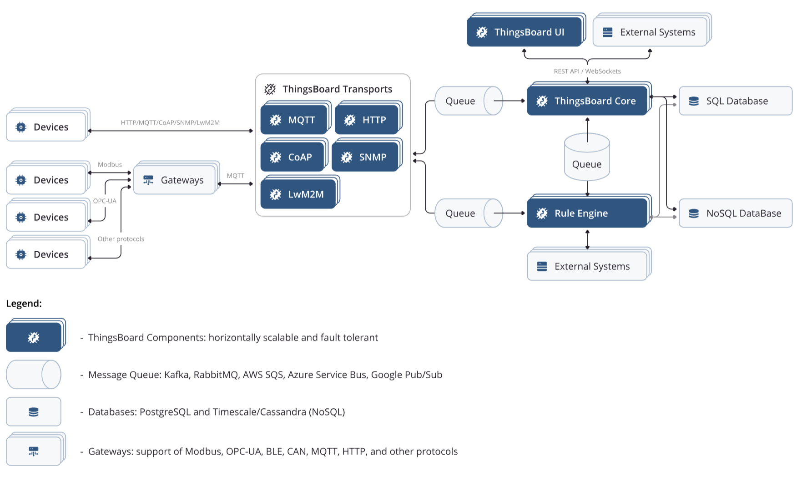

== ThingsBoard

=== Architecture

==== ThingsBoard services

ThingsBoard는 다음과 같이 설계되었습니다:

* *scalable*: 선도적인 오픈 소스 기술을 사용하여 수평적으로 확장 가능한 플랫폼.
* *fault-tolerant*: 단일 실패 지점이 없으며, 클러스터의 모든 노드는 동일합니다.
* *robust and efficient*: 단일 서버 노드는 사용 사례에 따라 수만 또는 심지어 수십만 개의 장치를 처리할 수 있습니다. ThingsBoard 클러스터는 수백만 개의 장치를 처리할 수 있습니다.
* *durable*: 데이터를 절대 잃지 않습니다. ThingsBoard는 극도로 높은 메시지 내구성을 제공하기 위해 다양한 큐 구현을 지원합니다.
* *customizable*: 사용자 정의 위젯과 규칙 엔진 노드로 새로운 기능을 쉽게 추가할 수 있습니다.
아래 다이어그램은 주요 시스템 구성 요소와 그들이 제공하는 인터페이스를 보여줍니다. 이들을 살펴보겠습니다.

*ThingsBoard Transports*

ThingsBoard는 장치 애플리케이션/펌웨어를 위해 MQTT, HTTP, CoAP 및 LwM2M 기반 API를 제공합니다. 각 프로토콜 API는 별도의 서버 구성 요소에 의해 제공되며 ThingsBoard의 "전송 계층"의 일부입니다. MQTT 전송은 여러 연결된 장치 및/또는 센서를 대표하는 게이트웨이에 의해 사용되는 게이트웨이 API도 제공합니다.

전송이 장치에서 메시지를 받으면, 이는 파싱되고 지속 가능한 메시지 큐로 푸시됩니다. 메시지 큐에 해당 메시지가 인정되면, 장치에 메시지 전달이 인정됩니다.

*ThingsBoard Core*

ThingsBoard 코어는 REST API 호출과 WebSocket 구독을 처리하는 역할을 합니다. 또한, 활성 장치 세션에 대한 최신 정보를 저장하고 장치 연결 상태를 모니터링하는 책임이 있습니다. ThingsBoard 코어는 주요 엔터티인 테넌트와 장치를 위한 액터를 구현하기 위해 내부적으로 액터 시스템을 사용합니다. 플랫폼 노드는 클러스터에 참여할 수 있으며, 각 노드는 들어오는 메시지의 특정 파티션에 대해 책임을 집니다.

*ThingsBoard 규칙 엔진*

ThingsBoard 규칙 엔진은 시스템의 핵심으로 들어오는 메시지를 처리하는 책임이 있습니다. 규칙 엔진은 주요 엔티티인 규칙 체인과 규칙 노드를 위한 액터를 구현하기 위해 내부적으로 액터 시스템을 사용합니다. 규칙 엔진 노드는 클러스터에 참여할 수 있으며, 각 노드는 들어오는 메시지의 특정 파티션에 대해 책임을 집니다.

규칙 엔진은 큐(들)에서 들어오는 데이터 피드를 구독하고 메시지가 처리되면 인정합니다. 메시지 처리의 순서와 메시지 인정 기준을 제어하는 여러 전략이 있습니다. 자세한 내용은 제출 전략 및 처리 전략을 참조하십시오.

ThingsBoard 규칙 엔진은 공유 및 격리된 두 가지 모드에서 작동할 수 있습니다. 공유 모드에서 규칙 엔진은 여러 테넌트에 속하는 메시지를 처리합니다. 격리 모드에서 규칙 엔진은 특정 테넌트 프로필의 테넌트에 대한 메시지만 처리하도록 구성될 수 있습니다.

*ThingsBoard Web UI*

ThingsBoard는 Express.js 프레임워크를 사용하여 작성된 경량 컴포넌트를 제공하여 정적 웹 UI 콘텐츠를 호스팅합니다. 이 컴포넌트는 완전히 상태 비저장이며 설정 가능한 옵션이 거의 없습니다. 정적 웹 UI에는 애플리케이션 번들이 포함되어 있습니다. 로드되면 애플리케이션은 ThingsBoard 코어가 제공하는 REST API 및 WebSockets API를 사용하기 시작합니다.

==== Message Queues are awesome!

ThingsBoard는 Kafka, RabbitMQ, AWS SQS, Azure Service Bus 및 Google Pub/Sub과 같은 여러 메시지 큐 구현을 지원합니다. 앞으로 이 목록을 확장할 계획입니다. 내구성 있고 확장 가능한 큐를 사용함으로써 ThingsBoard는 백프레셔와 로드 밸런싱을 구현할 수 있습니다. 백프레셔는 피크 부하 시 매우 중요합니다.

우리는 특정 큐 구현에 대한 "추상화 계층"을 제공하며 두 가지 주요 개념인 토픽과 토픽 파티션을 유지합니다. 하나의 토픽은 구성 가능한 파티션 수를 가질 수 있습니다. 대부분의 큐 구현이 파티션을 지원하지 않기 때문에, 우리는 토픽 + "." + 파티션 패턴을 사용합니다.

ThingsBoard 메시지 생산자는 엔티티 ID의 해시를 기반으로 어떤 파티션을 사용할지 결정합니다. 따라서 동일한 엔티티에 대한 모든 메시지는 항상 동일한 파티션으로 푸시됩니다. ThingsBoard 메시지 소비자는 Zookeeper를 사용하여 조정하며, 일관된 해시 알고리즘을 사용하여 각 소비자가 구독해야 하는 파티션 목록을 결정합니다. 마이크로서비스 모드에서 실행되는 경우, 각 서비스는 고유한 서비스 ID를 기반으로 하는 단일 파티션이 있는 전용 "알림" 토픽도 가집니다.

ThingsBoard는 다음과 같은 토픽을 사용합니다:

* *tb_transport.api.requests*: Transport에서 ThingsBoard 코어로 장치 자격 증명을 확인하기 위한 일반 API 호출 전송.
* *tb_transport.api.responses*: ThingsBoard 코어에서 Transport로 장치 자격 증명 검증 결과 수신.
* *tb_core*: Transport 또는 규칙 엔진에서 ThingsBoard 코어로 메시지 전송. 메시지에는 세션 수명 주기 이벤트, 속성 및 RPC 구독 등이 포함됩니다.
* *tb_rule_engine*: Transport 또는 ThingsBoard 코어에서 규칙 엔진으로 메시지 전송. 메시지에는 들어오는 텔레메트리, 장치 상태, 엔티티 수명 주기 이벤트 등이 포함됩니다.

*Note*: 모든 토픽 속성(이름 및 파티션 수 포함)은 thingsboard.yml 또는 환경 변수를 통해 구성할 수 있습니다. ThingsBoard 3.4부터는 UI를 통해 규칙 엔진 큐를 구성할 수 있습니다. 문서를 참조하세요.

*Note*: 버전 2.5부터 ThingsBoard 구성 요소 간의 모든 통신에 대해 gRPC에서 메시지 큐로 전환했습니다. 주요 아이디어는 지속적이고 신뢰할 수 있는 메시지 전달 및 자동 로드 밸런싱을 위해 소규모 성능/지연 패널티를 희생하는 것이었습니다.

==== On-premise vs Cloud Deployments:
ThingsBoard는 현장(On-premise)과 클라우드 배포를 모두 지원합니다. 전 세계에 5000개 이상의 ThingsBoard 서버가 운영 중이며, AWS, Azure, GCE, 그리고 개인 데이터 센터에서 제품을 운영하고 있습니다. ThingsBoard는 인터넷 접속이 전혀 없는 개인 네트워크에서도 실행이 가능합니다.

==== Standalone vs Cluster Mode:
이 플랫폼은 수평적 확장성을 목적으로 설계되었으며 새로운 ThingsBoard 서버(노드)의 자동 탐지를 지원합니다. 클러스터 내의 모든 ThingsBoard 노드는 동일하며 부하를 공유합니다. 모든 노드가 동일하기 때문에 “마스터”나 “코디네이터” 프로세스가 없으며 단일 실패 지점도 존재하지 않습니다. 사용자의 선택에 따른 로드 밸런서가 장치, 응용 프로그램, 사용자로부터의 요청을 모든 ThingsBoard 노드에 전달할 수 있습니다.

==== Monolithic vs Microservices Architecture:
ThingsBoard v2.2부터 플랫폼을 모놀리식(monolithic) 애플리케이션으로 또는 일련의 마이크로서비스로 실행할 수 있습니다. 두 옵션 모두를 지원하기 위해서는 추가적인 프로그래밍 노력이 필요하지만, 기존 설치들과의 호환성을 유지하기 위해 중요합니다.

플랫폼 설치의 약 80%는 여전히 모놀리식 모드를 사용하고 있는데, 이는 설치 및 유지보수 노력, 지식, 하드웨어 자원이 최소화되기 때문입니다.

그러나, 만약 고가용성이 필요하거나 수백만 개의 장치로 확장하고 싶다면 마이크로서비스가 적합한 방법입니다. 또한, 마이크로서비스 아키텍처로 해결되는 몇 가지 도전 과제들이 있으며, 이는 보다 복잡한 배포 및 사용 시나리오에 적용됩니다. 예를 들어, 더 세밀한 격리가 필요한 멀티테넌트 배포를 실행하는 경우:

- 예측 불가능한 부하 스파이크;
- 예측 불가능한 규칙 체인 오구성;
- 펌웨어 버그로 인해 수천 개의 동시 연결을 여는 단일 장치;
- 그 밖의 많은 경우들.

아래 링크를 따라 올바른 아키텍처 및 배포 옵션을 선택하고 자세히 알아보세요:

모놀리식: ThingsBoard 플랫폼을 모놀리식 모드로 배포, 구성, 실행하는 방법에 대해 자세히 알아보세요.
마이크로서비스: ThingsBoard 플랫폼을 마이크로서비스 모드로 배포, 구성, 실행하는 방법에 대해 자세히 알아보세요.

==== SQL vs NoSQL vs Hybrid Database Approach:
SQL vs NoSQL vs Hybrid Database Approach:
ThingsBoard는 데이터베이스를 사용하여 엔티티(장치, 자산, 고객, 대시보드 등)와 원격 측정 데이터(속성, 시계열 센서 읽기, 통계, 이벤트)를 저장합니다. 현재 플랫폼은 세 가지 데이터베이스 옵션을 지원합니다:

* *SQL*: 모든 엔티티와 원격 측정 데이터를 SQL 데이터베이스에 저장합니다. ThingsBoard 개발자들은 PostgreSQL 사용을 권장하며, 이것이 ThingsBoard가 지원하는 주요 SQL 데이터베이스입니다. 로컬 개발 목적으로 HSQLDB를 사용할 수 있으나, 테스트 실행 및 최소한의 부하를 가진 개발 인스턴스를 실행하는 것 이외에는 권장하지 않습니다.

*  *NoSQL (사용 중단됨)*: 모든 엔티티와 원격 측정 데이터를 NoSQL 데이터베이스에 저장합니다. ThingsBoard 개발자들은 Cassandra 사용을 권장하지만, 현재 ThingsBoard가 지원하는 유일한 NoSQL 데이터베이스입니다. IoT 엔티티에 대한 고급 검색을 가능하게 하는 트랜잭션과 "조인(join)"에 대한 NoSQL의 여러 한계로 인해 이 옵션은 하이브리드 접근 방식을 선호하는 것으로 사양되었습니다.

* *하이브리드 (PostgreSQL + Cassandra)*: 모든 엔티티를 PostgreSQL 데이터베이스에 저장하고 시계열 데이터는 Cassandra 데이터베이스에 저장합니다.

* *하이브리드 (PostgreSQL + TimescaleDB)*: 모든 엔티티를 PostgreSQL 데이터베이스에 저장하고 시계열 데이터는 TimescaleDB에 저장합니다.

이러한 옵션은 `thingsboard.yml` 파일을 사용하여 구성할 수 있습니다. 데이터베이스 구성에 대한 자세한 내용은 ThingsBoard의 해당 구성 페이지에서 확인할 수 있습니다.