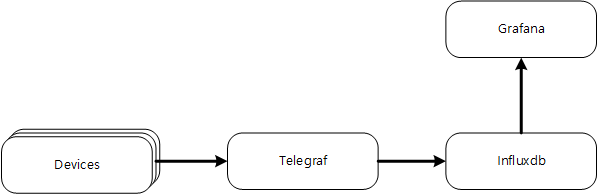

=== TIG

==== Telegraf

Telegraf는 데이터 수집 및 리포팅 에이전트로, 다양한 소스로부터 메트릭 및 데이터를 수집하고 이를 다른 시스템으로 전송하는 데 사용됩니다. Telegraf의 주요 기능은 다음과 같습니다:

* *플러그인 기반 아키텍처*: Telegraf는 입력(input), 출력(output), 프로세서(processor), 집계(aggregator) 플러그인을 지원합니다. 이러한 플러그인은 다양한 데이터 소스와 목적지를 연결하는 데 사용됩니다.
* *다양한 데이터 소스 지원*: 입력 플러그인을 통해 다양한 소스로부터 데이터를 수집할 수 있습니다. 이는 시스템 메트릭, 센서 데이터, 로그 파일, 클라우드 서비스 등이 될 수 있습니다.
* *유연한 데이터 출력 옵션*: 출력 플러그인을 사용하여 수집된 데이터를 다양한 형태로 저장하거나 전송할 수 있습니다. 예를 들어, 시계열 데이터베이스, 메시징 큐, 모니터링 도구 등이 이에 해당합니다.
* *데이터 처리 및 집계*: 프로세서와 집계 플러그인을 통해 데이터를 변환하거나 집계할 수 있습니다. 이를 통해 데이터의 취합, 정규화, 풍부화가 가능합니다.
* *실시간 데이터 처리*: Telegraf는 실시간으로 데이터를 수집하고 처리할 수 있어, 시스템의 실시간 모니터링 및 반응이 가능합니다.
* *경량 및 고성능**: Telegraf는 경량화되어 있어 리소스가 제한된 환경에서도 효율적으로 실행될 수 있습니다. 또한, 고성능을 제공하여 대규모 데이터 수집에 적합합니다.
* *간편한 구성 및 확장성*: Telegraf의 구성은 간단하며, 필요에 따라 새로운 플러그인을 추가하여 기능을 확장할 수 있습니다.
* *통합 및 호환성*: 다양한 시계열 데이터베이스 및 모니터링 도구와 통합이 가능합니다. 이는 InfluxDB와 같은 시스템과의 호환성을 포함합니다.

Telegraf는 주로 모니터링 및 로그 관리 시스템의 일부로 사용되며, 효율적인 데이터 수집 및 전송을 통해 시스템의 성능 및 가용성 모니터링을 개선하는 데 기여합니다.

==== Influxdb

InfluxDB는 시계열 데이터를 위한 오픈 소스 데이터베이스입니다. 시계열 데이터란 시간의 흐름에 따라 기록되는 데이터로, 예를 들어 센서 데이터, 주식 시장 데이터, 서버 성능 메트릭 등이 있습니다. InfluxDB의 주요 특징과 기능은 다음과 같습니다:

* *시계열 데이터 최적화*: InfluxDB는 시계열 데이터의 효율적인 저장, 검색, 그리고 실시간 분석을 위해 설계되었습니다. 이는 데이터가 시간 순서대로 기록되고 조회되는 특성을 갖고 있습니다.

* *빠른 읽기/쓰기 성능*: InfluxDB는 높은 쓰기 성능과 빠른 쿼리 응답 시간을 제공합니다. 이는 대량의 시계열 데이터를 실시간으로 처리하는 데 적합합니다.

* *직관적인 쿼리 언어 (InfluxQL)*: SQL과 유사한 쿼리 언어를 제공하여 사용자가 데이터에 쉽게 질의하고 분석할 수 있도록 합니다.

* *데이터 압축 및 보존 정책*: 자동 데이터 압축 및 보존 정책을 통해 데이터 저장 공간을 효율적으로 관리할 수 있습니다. 오래된 데이터는 자동으로 삭제하거나 압축하여 저장 공간을 절약할 수 있습니다.

* *내장된 시계열 함수*: 다양한 시계열 데이터 처리 함수를 제공하여, 시간 범위 선택, 데이터 집계, 평균, 최대값, 최소값 계산 등을 손쉽게 할 수 있습니다.

* *확장성 및 고가용성*: 클러스터링을 통해 대규모 데이터 처리 및 고가용성을 제공합니다. 이를 통해 부하 분산과 장애 복구가 가능합니다.

* *API 및 통합 지원*: RESTful API를 제공하여 다양한 프로그래밍 언어와의 통합이 용이합니다. 또한, Telegraf와 같은 데이터 수집 도구와의 강력한 통합을 지원합니다.

* *사용자 인터페이스*: 데이터베이스 관리 및 데이터 시각화를 위한 사용자 친화적인 인터페이스를 제공합니다.

InfluxDB는 IoT, 모니터링, 분석 애플리케이션 등 시계열 데이터를 다루는 다양한 분야에서 널리 사용됩니다. 데이터의 시간적 특성을 중요시하는 경우, InfluxDB는 효과적인 데이터 저장 및 분석 솔루션을 제공합니다.

==== Grafana

Grafana는 강력하고 인기 있는 오픈 소스 분석 및 시각화 플랫폼입니다. 주로 모니터링 및 데이터 분석에 사용되며, 다양한 데이터 소스에서 수집된 데이터를 시각적으로 나타내는 데에 탁월합니다. Grafana의 주요 특징과 기능은 다음과 같습니다:

* *다양한 데이터 소스 지원*: Grafana는 InfluxDB, Prometheus, MySQL, PostgreSQL, Microsoft SQL Server, Elasticsearch 등 다양한 데이터베이스 및 모니터링 도구와 연동할 수 있습니다.

* *강력한 시각화 기능*: 다양한 유형의 차트, 그래프, 테이블, 지도 등을 이용하여 데이터를 시각화할 수 있습니다. 이를 통해 복잡한 데이터를 쉽게 이해하고 분석할 수 있습니다.

* *대시보드*: 사용자 정의 가능한 대시보드를 통해 필요한 모든 시각화를 한 곳에서 볼 수 있으며, 이를 공유하거나 내보낼 수도 있습니다.

* *경보 및 알림*: 데이터 트렌드를 모니터링하고, 설정한 임계값을 초과하는 경우 이메일, Slack, PagerDuty 등 다양한 방법으로 알림을 받을 수 있습니다.

* *사용자 및 권한 관리*: 다양한 사용자와 팀에 대한 액세스 권한을 관리할 수 있어, 팀별로 맞춤화된 대시보드를 제공하거나 데이터 접근을 제한할 수 있습니다.

* *플러그인 및 확장성*: Grafana는 다양한 플러그인을 지원하여 기능을 확장할 수 있습니다. 커뮤니티에서 제공하는 플러그인 또는 사용자가 직접 개발한 플러그인을 추가할 수 있습니다.

* *API 지원*: REST API를 통해 프로그래밍적으로 대시보드를 관리하거나 데이터를 검색할 수 있습니다.

* *멀티 테넌시 지원*: 하나의 Grafana 인스턴스에서 여러 조직이나 사용자 그룹을 관리할 수 있어, 대규모 시스템에서 유용합니다.

Grafana는 IT 인프라 모니터링, 애플리케이션 성능 모니터링, IoT 기기 데이터 시각화 등 다양한 분야에서 사용됩니다. 사용자 친화적인 인터페이스와 강력한 시각화 기능은 데이터 기반의 의사결정을 지원하는 데 큰 도움을 줍니다.
