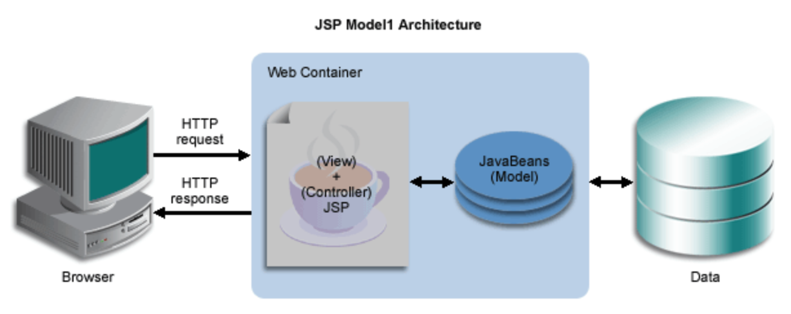
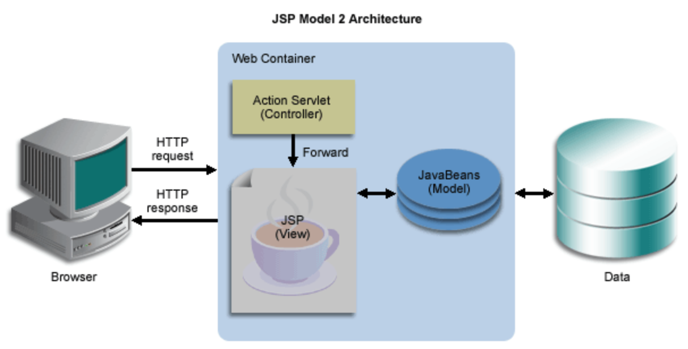
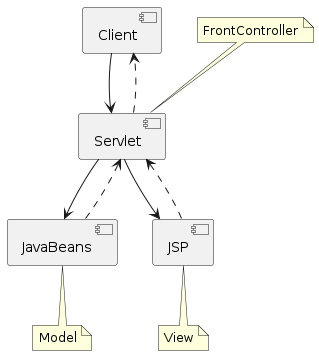
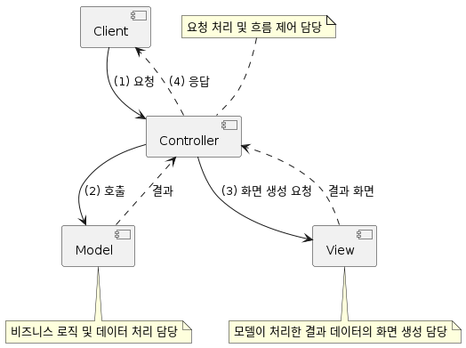

= MVC Pattern

* `Model`  + `View` + `Controller`

== MVC Model1

* JSP에서 모든 로직과 출력을 처리합니다.
* 즉 JSP 페이지에 비지니스 로직을 처리하기 위한 코드와 웹브라우저에 결과를 출력하는 코드가 섞여 있습니다.

== MVC Model2
* 모든 요청을 서블릿이 받아 처리하고 JSP 페이지로 포워드 합니다.
* 서블릿은 클라이언트(브라우저) 요청을 구분하여 처리합니다.

=== JSP Model2
* servlet/jsp 기반의 Model2 +

=== Model2
* Spring MVC 기반 Model2
** 일반적으로 Model2 방식을 MVC Pattern이라고 합니다. +

