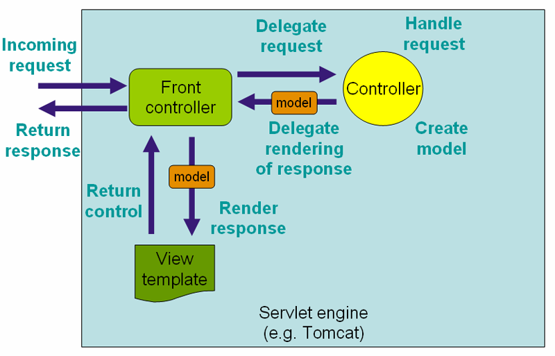

= Context

== Context란?
* Spring에서 Context는 스프링이 관리하는 빈들이 담겨있는 컨테이너 입니다.

== ROOT-CONTEXT
* 모든 Servlet이 공유할 수 있는 Bean들이 모인 공간
* `@Repository`, `@Service`, `@Component`, `@Configuration`

== Bean Factory
* Bean 생성및 의존관계 설정을 담당하는 가장 기본적인 IOC Container

* Lazy loading : XmlBeanFactory 방식
** 빈 로딩 요청을 받는 시점에 인스턴스를 만들고 로딩하는 방식
** Deprecated!

* Pre loading : ApplicationContext 방식
** 모든 빈 들과 설정 파일들이 ApplicationContext에 의해 로드 요청이 될 때 인스턴스로 만들어지고 로드 되는 방식

=== ApplicationContext
* Spring 에서는 ROOT-CONTEXT를 ApplicationContext라고 불립니다.
* BeanFactory를 상속

* xml 기반의 설정
** ApplicationContext의 설정 정보를 담고 있는 파일
*** root-context.xml
*** applicationContext.xml

[source,xml]
----
<?xml version="1.0" encoding="UTF-8"?>
<beans xmlns="http://www.springframework.org/schema/beans"
    xmlns:xsi="http://www.w3.org/2001/XMLSchema-instance"
    xmlns:context="http://www.springframework.org/schema/context" xsi:schemaLocation="
        http://www.springframework.org/schema/beans http://www.springframework.org/schema/beans/spring-beans.xsd
        http://www.springframework.org/schema/context http://www.springframework.org/schema/context/spring-context.xsd">

    <!-- bean definitions here -->
    <bean id="complexRemoteEjb"
        class="org.springframework.ejb.access.SimpleRemoteStatelessSessionProxyFactoryBean">
        <property name="jndiName" value="ejb/MyRemoteBean"/>
        <property name="businessInterface" value="com.foo.service.RentalService"/>
        <property name="cacheHome" value="true"/>
        <property name="lookupHomeOnStartup" value="true"/>
        <property name="resourceRef" value="true"/>
        <property name="homeInterface" value="com.foo.service.RentalService"/>
        <property name="refreshHomeOnConnectFailure" value="true"/>
    </bean>
</beans>
----

* Using web.xml and an XML Application Context

** contextConfigLocation param을 명시적으로 지정하지 않는다면 /WEB/INF/applicationContext.xml을 읽습니다.

[source,xml]
----
<listener>
    <listener-class>
        org.springframework.web.context.ContextLoaderListener
    </listener-class>
</listener>

<context-param>
    <param-name>contextConfigLocation</param-name>
    <param-value>/WEB-INF/applicationContext.xml</param-value>
</context-param>
----

* ApplicationContext 구현체
** ClassPathXmlApplicationContext
** FileSystemXmlApplicationContext
** AnnotationConfigWebApplicationContext

== WebApplicationContext

* Servlet 단위로 생성되는 context
** DispatcherServlet ( fornt controller )
*** /WEB-INF/dispatcherServlet-xml ( DispatcherServlet 생성시 필요한 정보를 담고있는 파일 )
** URL 관련 설정이 있는 bean
*** Interceptor, @Controller
*** Servlet 간에는 bean을 공유할 수 없음

____
Web Application Context =  Servlet Context  + Application Context
____

== Reference
* https://docs.spring.io/spring-framework/docs/4.2.x/spring-framework-reference/html/xsd-configuration.html[XML Schema-based configuration]

* https://www.baeldung.com/spring-web-contexts
