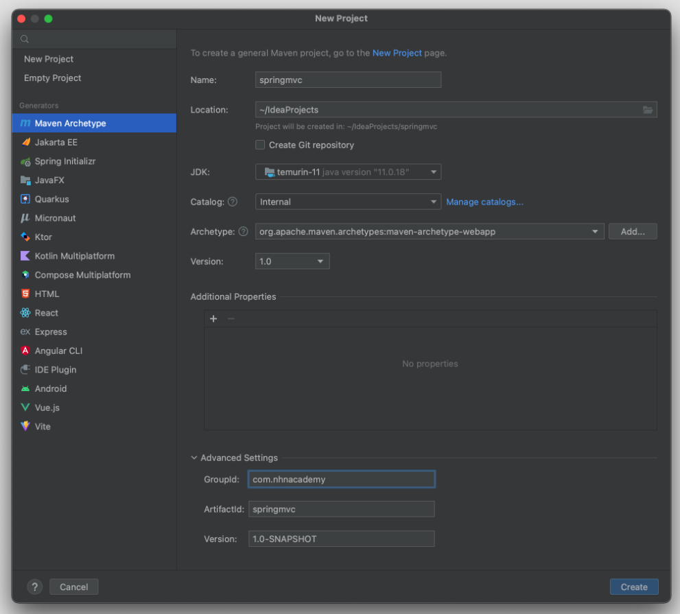
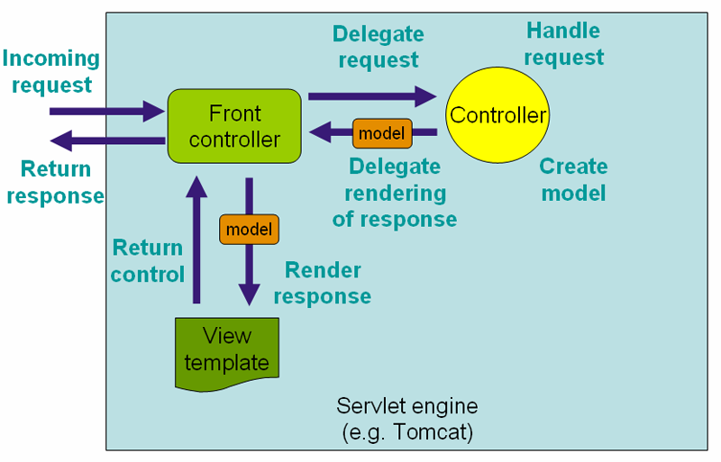
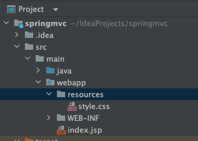
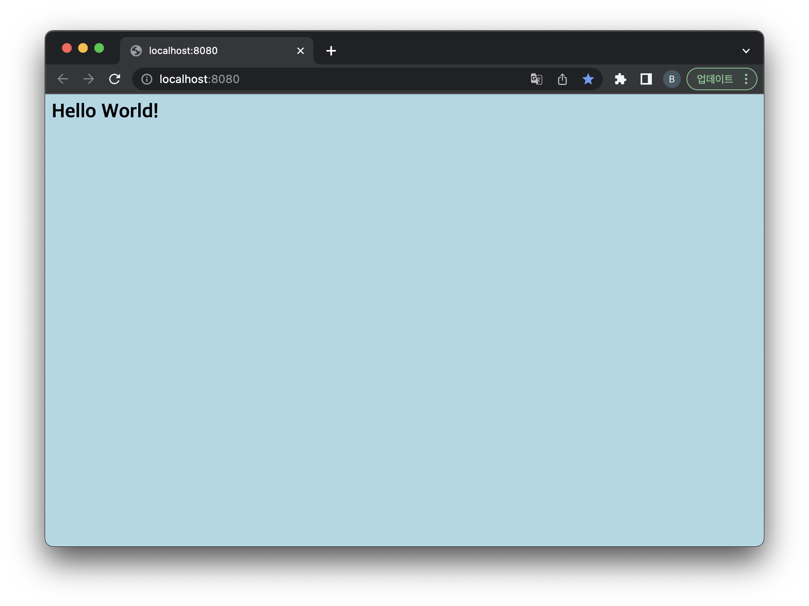
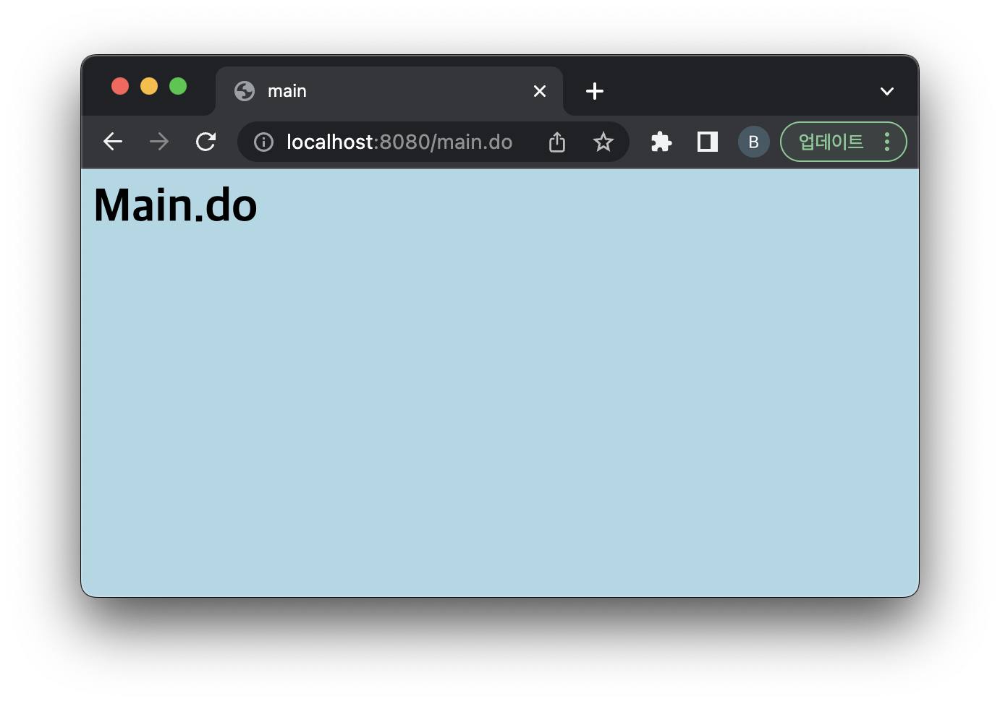
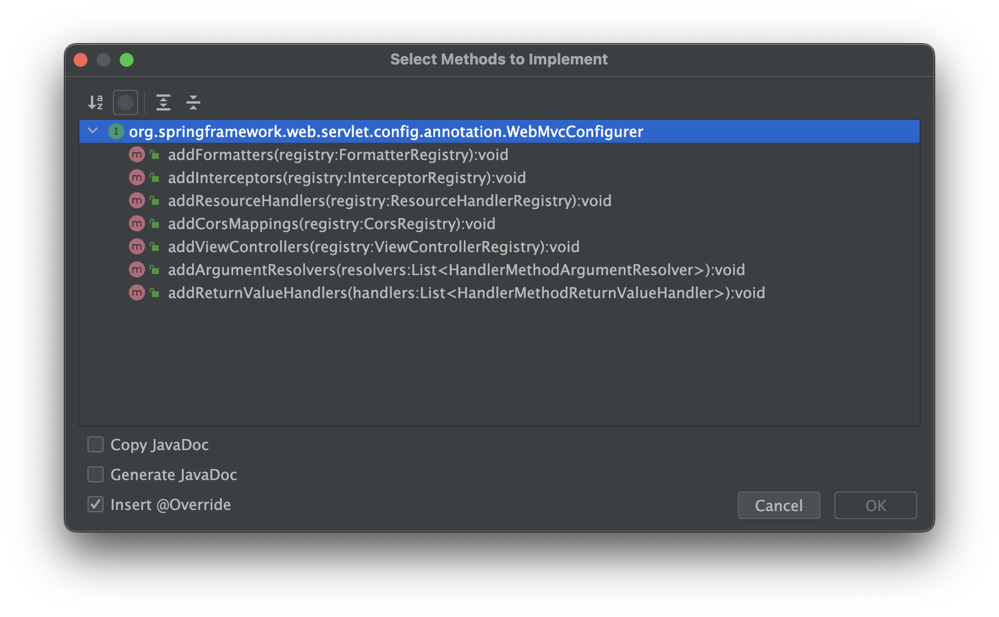
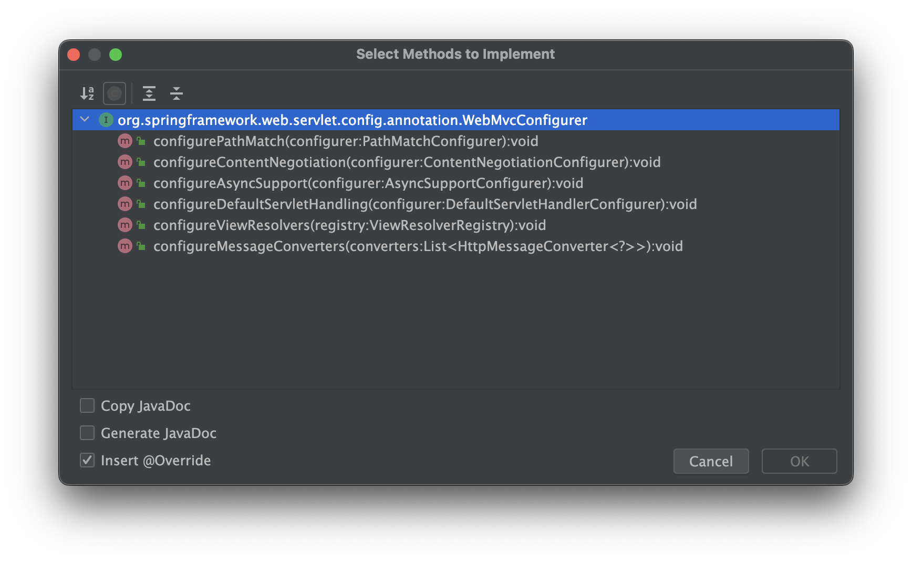

== 실습 - Spring-MVC Project 생성

* File -&gt; New -&gt; Project
** ArcheType : org.apache.maven.archetypes:maven-archetype-webapp
** JDK : 11



== pom.xml

[source,xml]
----
<project xmlns="http://maven.apache.org/POM/4.0.0" xmlns:xsi="http://www.w3.org/2001/XMLSchema-instance"
  xsi:schemaLocation="http://maven.apache.org/POM/4.0.0 http://maven.apache.org/maven-v4_0_0.xsd">
  <modelVersion>4.0.0</modelVersion>
  <groupId>com.nhnacademy</groupId>
  <artifactId>springmvc</artifactId>
  <packaging>war</packaging>
  <version>1.0-SNAPSHOT</version>
  <name>springmvc Maven Webapp</name>
  <url>http://maven.apache.org</url>

  <properties>
    <maven.compiler.source>11</maven.compiler.source>
    <maven.compiler.target>11</maven.compiler.target>
  </properties>
  <!-- spring-framework 의존성 관리 -->
  <dependencyManagement>
    <dependencies>
      <dependency>
        <groupId>org.springframework</groupId>
        <artifactId>spring-framework-bom</artifactId>
        <version>5.3.25</version>
        <type>pom</type>
        <scope>import</scope>
      </dependency>
    </dependencies>
  </dependencyManagement>

  <dependencies>

    <dependency>
      <groupId>org.springframework</groupId>
      <artifactId>spring-webmvc</artifactId>
    </dependency>

    <!-- servlet api -->
    <dependency>
      <groupId>jakarta.servlet</groupId>
      <artifactId>jakarta.servlet-api</artifactId>
      <version>4.0.4</version>
      <scope>provided</scope>
    </dependency>

    <!-- jstl -->
    <dependency>
      <groupId>org.glassfish.web</groupId>
      <artifactId>jakarta.servlet.jsp.jstl</artifactId>
      <version>1.2.6</version>
      <scope>runtime</scope>
    </dependency>

    <!-- logging -->
    <dependency>
      <groupId>org.projectlombok</groupId>
      <artifactId>lombok</artifactId>
      <version>1.18.24</version>
    </dependency>

    <dependency>
      <groupId>ch.qos.logback</groupId>
      <artifactId>logback-classic</artifactId>
      <version>1.2.11</version>
    </dependency>
    <!-- json -->
    <dependency>
      <groupId>com.fasterxml.jackson.core</groupId>
      <artifactId>jackson-databind</artifactId>
      <version>2.14.2</version>
    </dependency>
    <dependency>
      <groupId>com.fasterxml.jackson.datatype</groupId>
      <artifactId>jackson-datatype-jsr310</artifactId>
      <version>2.14.2</version>
    </dependency>

  </dependencies>

  <build>
    <finalName>springmvc</finalName>

    <plugins>
      <plugin>
        <groupId>org.apache.maven.plugins</groupId>
        <artifactId>maven-compiler-plugin</artifactId>
        <version>3.10.1</version>
        <configuration>
          <target>11</target>
          <source>11</source>
        </configuration>
      </plugin>
    </plugins>

  </build>
</project>

----

== web.xml

=== application context ( Root Context )

* application context는 ContextLoaderListener에 의해서 생성됩니다.
* ContextLoaderListener 가 만드는 ApplicationContext 가 Root WebApplicationContext 가 되어 모든 servlet 에서 공통으로 사용할 수 있도록 `@Service`, `@Repository`, `@Component`, `@Configuration` 역할을 하는 Bean들을 등록합니다.

[source,xml]
----
<context-param>
    <param-name>contextClass</param-name>
    <param-value>org.springframework.web.context.support.AnnotationConfigWebApplicationContext</param-value>
</context-param>
<context-param>
    <param-name>contextConfigLocation</param-name>
    <param-value>com.nhnacademy.springmvc.config.RootConfig</param-value>
</context-param>
<listener>
<listener-class>org.springframework.web.context.ContextLoaderListener</listener-class>
</listener>
----

=== RootConfig.java

- `@ComponentScan` : Stereo Type Bean Scan
- excludeFilter : @Controller.class 제외

[source,java]
----
package com.nhnacademy.springmvc.config;

import org.springframework.context.annotation.ComponentScan;
import org.springframework.context.annotation.Configuration;
import org.springframework.stereotype.Controller;

@Configuration
@ComponentScan(basePackages = {"com.nhnacademy.springmvc"},
        excludeFilters = { @ComponentScan.Filter(Controller.class) })
public class RootConfig {

}
----

=== web application context

* dispatcherServlet
** Spring MVC Framework의 중심이 되는 Servlet
** `Controller` 로 향하는 모든 웹 요청의 entry point
** `Front Controller` 디자인 패턴의 표현
** 서블릿 이름에 해당되는 xml파일을 읽어드려 파일에 정의된 Bean들을 Spring IoC 컨테이너에 생성합니다.

----
/WEB-INF/'서블릿 이름'-servlet.xml => /WEB-INF/dispatcherServlet-servlet.xml
----

[source,xml]
----
<servlet>
    <servlet-name>dispatcherServlet</servlet-name>
    <servlet-class>org.springframework.web.servlet.DispatcherServlet</servlet-class>
    <init-param>
      <param-name>contextConfigLocation</param-name>
      <param-value>/WEB-INF/dispatcherServlet-servlet.xml</param-value>
    </init-param>
    <load-on-startup>1</load-on-startup>
  </servlet>

  <servlet-mapping>
    <servlet-name>dispatcherServlet</servlet-name>
    <url-pattern>/</url-pattern>
  </servlet-mapping>
----

* /WEB-INF/web.xml

[source,xml]
----
<?xml version="1.0" encoding="UTF-8"?>
<web-app>
  <display-name>spring-mvc application</display-name>
  <!-- todo-1  application Context -->
  <context-param>
    <param-name>contextClass</param-name>
    <param-value>org.springframework.web.context.support.AnnotationConfigWebApplicationContext</param-value>
  </context-param>

  <!-- todo-2 web application context -->
  <servlet>
    <servlet-name>dispatcherServlet</servlet-name>
    <servlet-class>org.springframework.web.servlet.DispatcherServlet</servlet-class>
    <init-param>
      <param-name>contextConfigLocation</param-name>
      <param-value>/WEB-INF/dispatcherServlet-servlet.xml</param-value>
    </init-param>
    <load-on-startup>1</load-on-startup>
  </servlet>

  <servlet-mapping>
    <servlet-name>dispatcherServlet</servlet-name>
    <url-pattern>/</url-pattern>
  </servlet-mapping>

  <!-- todo-3 encoding filter -->
  <filter>
    <filter-name>encodingFilter</filter-name>
    <filter-class>org.springframework.web.filter.CharacterEncodingFilter</filter-class>
    <init-param>
      <param-name>encoding</param-name>
      <param-value>UTF-8</param-value>
    </init-param>
    <init-param>
      <param-name>forceRequestEncoding</param-name>
      <param-value>true</param-value>
    </init-param>
    <init-param>
      <param-name>forceResponseEncoding</param-name>
      <param-value>true</param-value>
    </init-param>
  </filter>
  <filter-mapping>
    <filter-name>encodingFilter</filter-name>
    <url-pattern>/*</url-pattern>
  </filter-mapping>

  <!-- todo-4 hidden httpMethodFilter -->
  <filter>
    <filter-name>httpMethodFilter</filter-name>
    <filter-class>org.springframework.web.filter.HiddenHttpMethodFilter</filter-class>
  </filter>
  <filter-mapping>
    <filter-name>httpMethodFilter</filter-name>
    <url-pattern>/*</url-pattern>
  </filter-mapping>

</web-app>
----

=== encoding filter

* UTF-8 encoding ( 한글 께짐 방지 )

[source,xml]
----
<filter>
    <filter-name>encodingFilter</filter-name>
    <filter-class>org.springframework.web.filter.CharacterEncodingFilter</filter-class>
    <init-param>
      <param-name>encoding</param-name>
      <param-value>UTF-8</param-value>
    </init-param>
    <init-param>
      <param-name>forceRequestEncoding</param-name>
      <param-value>true</param-value>
    </init-param>
    <init-param>
      <param-name>forceResponseEncoding</param-name>
      <param-value>true</param-value>
    </init-param>
</filter>
<filter-mapping>
    <filter-name>encodingFilter</filter-name>
    <url-pattern>/*</url-pattern>
</filter-mapping>
----

=== hidden httpMethodFilter

* Hidden 타입의 input 태그의 속성들을 읽어서 HttpServletRequestWrapper.getMethod() 반환 값을 변경해 요청된 HTTP 메소드의 타입을 PUT, DELETE, PATCH로 변경해주는 필터 입니다.

[source,xml]
----
 <filter>
    <filter-name>httpMethodFilter</filter-name>
    <filter-class>org.springframework.web.filter.HiddenHttpMethodFilter</filter-class>
  </filter>
  <filter-mapping>
    <filter-name>httpMethodFilter</filter-name>
    <url-pattern>/*</url-pattern>
  </filter-mapping>
----

* 참고

[source,html]
----
<form>
    <input type="hidden" name="_method" value="put"/>
</form>
----

== /WEB-INF/dispatcherServlet-servlet.xml

=== Sources Root 설정

----
/src/main/java
----



=== todo-5

* todo-5 base package 설정
** use-default-filters=true ( default = true )
*** @Controller, @Repository, @Component, @Service, @Configuration … 스켄을 합니다.
** use-default-filters=false +. include-filter 사용해서 @Controller만 스켄될 수 있도록 설정.
[source,xml]
----
 <!--todo-5 base package 설정 -->
<context:component-scan base-package="com.nhnacademy.springmvc" use-default-filters="false">
    <context:include-filter type="annotation" expression="org.springframework.stereotype.Controller"/>
</context:component-scan>
----

=== dispatcherServlet-servlet.xml

[source,xml]
----
<?xml version="1.0" encoding="UTF-8"?>
<beans xmlns="http://www.springframework.org/schema/beans"
       xmlns:mvc="http://www.springframework.org/schema/mvc"
       xmlns:xsi="http://www.w3.org/2001/XMLSchema-instance"
       xmlns:context="http://www.springframework.org/schema/context"
       xsi:schemaLocation="http://www.springframework.org/schema/beans
                    http://www.springframework.org/schema/beans/spring-beans.xsd
                    http://www.springframework.org/schema/mvc
                    http://www.springframework.org/schema/mvc/spring-mvc.xsd http://www.springframework.org/schema/context https://www.springframework.org/schema/context/spring-context.xsd">

    <!--todo-5 base package 설정 -->
    <context:component-scan base-package="com.nhnacademy.springmvc" use-default-filters="false">
        <context:include-filter type="annotation" expression="org.springframework.stereotype.Controller"/>
    </context:component-scan>

    <!--todo-6 annotation 활성화 -->
    <mvc:annotation-driven />

    <!--todo-7 resources directory : css, img ... static resources -->
    <mvc:resources mapping="/resources/**" location="/resources/" />

    <!--todo-8 view Resolver -->
    <bean class="org.springframework.web.servlet.view.InternalResourceViewResolver">
        <constructor-arg name="prefix" value="/WEB-INF/views/" />
        <constructor-arg name="suffix" value=".jsp" />
    </bean>
</beans>
----

=== todo-7 static resources 경로설정 ( img, js, css …. 등등 )

----
/src/main/webapp/resources //생성
----



=== /resources/style.css

* 확인을 위해서 간단하게 background-color 지정
[source,css]
----
body{
    background-color:lightblue;
}
----

=== tomcat start



=== todo-8 view resolver

[xml]
```
<bean class="org.springframework.web.servlet.view.InternalResourceViewResolver">
    <constructor-arg name="prefix" value="/WEB-INF/views/" />
    <constructor-arg name="suffix" value=".jsp" />
</bean>
```

* MainController 작성 : com.nhnacademy.springmvc.controller.MainController.java
** *mapping : /main.do*
[source,java]
----
package com.nhnacademy.springmvc.controller;
import org.springframework.stereotype.Controller;
import org.springframework.web.bind.annotation.GetMapping;

@Controller
public class MainController {

    @GetMapping("/main.do")
    public String main(){
        return "main";
    }
}
----

* /WEB-INF/views/main.jsp

[source,html]
----
<%@ page contentType="text/html;charset=UTF-8" language="java" %>
<html>
<head>
    <link rel="stylesheet" href="/resources/style.css" />
    <title>main</title>
</head>
<body>
    <h1>Main.do</h1>
</body>
</html>
----

=== tomcat restart



== dispatcherServlet : xml to java

=== web.xml : dispatcherServlet

* AnnotationConfigWebApplicationContext 이용해서 annotation 기반으로 설정
[source,xml]
----
<servlet>
    <servlet-name>dispatcherServlet</servlet-name>
    <servlet-class>org.springframework.web.servlet.DispatcherServlet</servlet-class>
    <init-param>
      <param-name>contextClass</param-name>
      <param-value>org.springframework.web.context.support.AnnotationConfigWebApplicationContext</param-value>
    </init-param>
    <init-param>
      <param-name>contextConfigLocation</param-name>
      <param-value>com.nhnacademy.springmvc.config.WebConfig</param-value>
    </init-param>
    <load-on-startup>1</load-on-startup>
</servlet>
----

=== WebConfig

[source,java]
----
package com.nhnacademy.springmvc.config;

import org.springframework.context.annotation.ComponentScan;
import org.springframework.context.annotation.Configuration;
import org.springframework.web.servlet.config.annotation.EnableWebMvc;
import org.springframework.web.servlet.config.annotation.ViewResolverRegistry;
import org.springframework.web.servlet.config.annotation.WebMvcConfigurer;

@EnableWebMvc
@Configuration
@ComponentScan(basePackages = "com.nhnacademy.springmvc.**.controller")
public class WebConfig  implements WebMvcConfigurer {
    @Override
    public void configureViewResolvers(ViewResolverRegistry registry) {
        registry.jsp("/WEB-INF/views/",".jsp");
    }

    @Override
    public void addResourceHandlers(ResourceHandlerRegistry registry) {
        registry.addResourceHandler("/resources/**").addResourceLocations("/resources/");
    }
}
----

== WebMv Configuration

=== @EnableWebMc

* 기본설정
* WebMvcConfigurationSupport에서 구성한 Spring MVC 구성을 사용하겠다는 의미.

=== Customizing with @EnableWebMvc

* WebMvcConfigurer 인터페이스 구현

** Spring MVC에 필요한

** add~~ : 새로운 빈이나 오브젝트를 추가하는것


** configure~~ : 설정작업을 하는것


=== cf.) Spring Boot 에서는

* WebMvcAutoConfiguration 에서 자동으로 해줌
