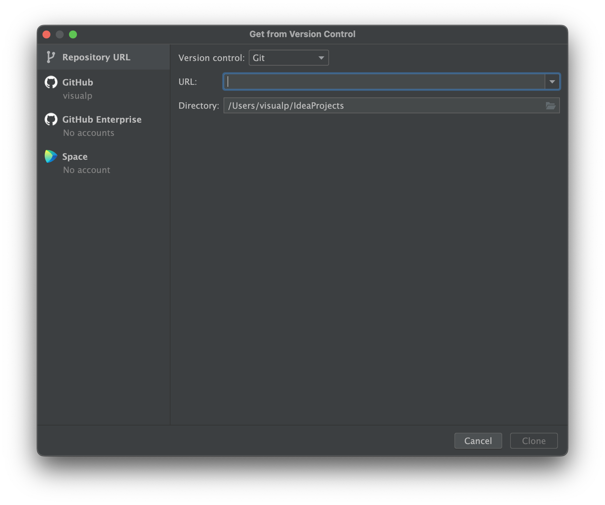
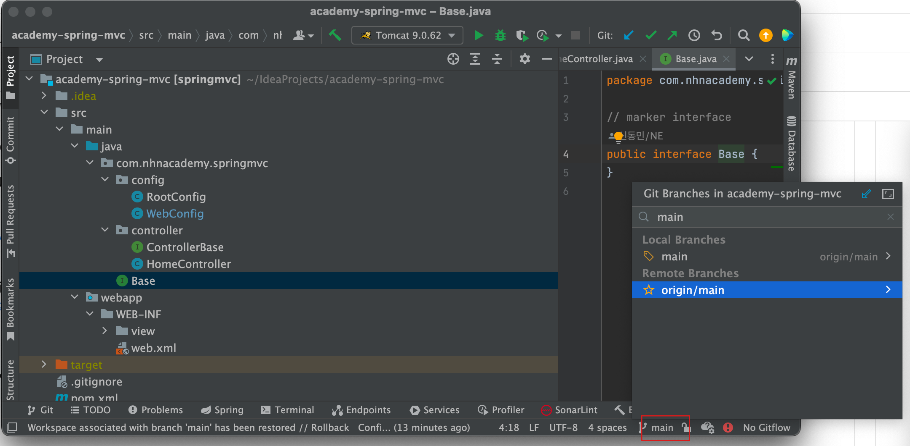

= git clone

== IntelliJ 에서 `Get from VCS` 로 프로젝트 생성

* URL
** https://github.com/dongmyo/academy-spring-mvc
* Clone

----
git clone https://github.com/dongmyo/academy-spring-mvc
----

== Intellij &gt; git &gt; clone

== check out main branch

----
git checkout main
----

== 전체적인 구조 살펴보기

=== web.xml 기반의 환경설정.

=== 반드시 기억해야 할 것

* RootConfig : ROOT-CONTEXT == Application Context
** @Controller를 제외한 Stereotype bean
* WebConfig : SERVLET-CONTEXT == WebApplicationContext
** @Controller , Interceptor