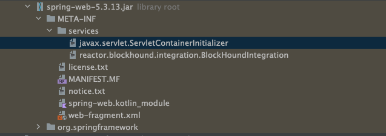
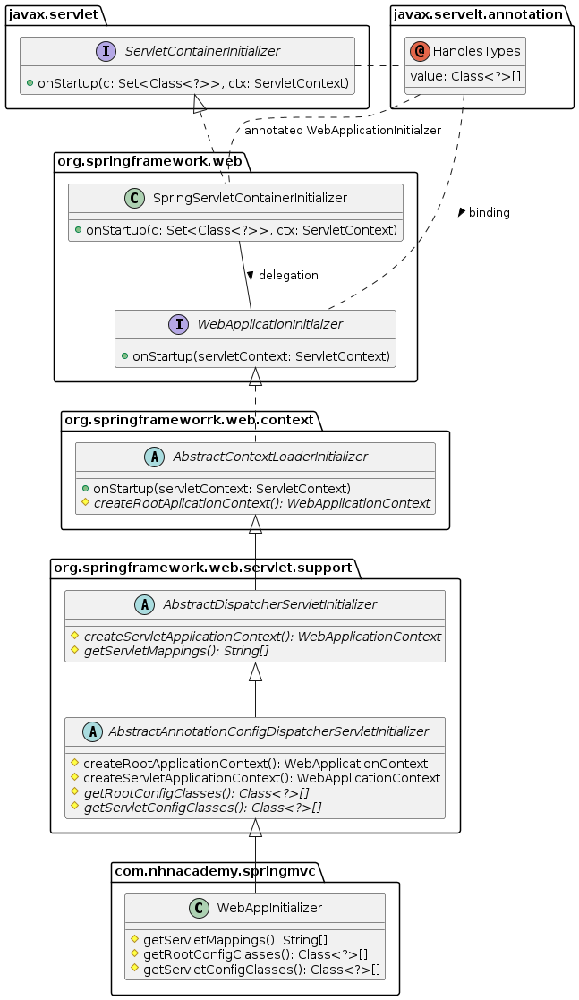

= WebApplicationInitializer

== WebApplicationInitializer version

----
git checkout initializer

----

== Servlet 3.0 spec

* web.xml 없이 Servlet Context를 초기화할 수 있는 방법이 정의되어있습니다.
* Servlet, filter, listener 컴포넌트의 등록을 코드로 입력하거나 web.xml 파일에 정의하여 사용할 수 있습니다.
* ServletContext대 관련된 method가 추가됩니다. 이를 사용하기 위해서는 ServletContainerInitializer -> onStartup method를 호출하면 됩니다.

=== servlet/jsp 2일차 교제 ..

* https://github.com/nhnacademy-bootcamp/java-servlet-jsp/blob/main/day02/05.Servlet%203.0%20Annotations/index.adoc[javax.servlet.ServletContainerInitializer, window=_blank]

=== was가 실행될 때 ServletContainerInitializer service provider를 찾고 @HandlerTypes로 정의된 클래스를 실행합니다.

* spring-web

----
/META-INF/services/javax.servlet.ServletContainerInitializer
----

----
org.springframework.web.SpringServletContainerInitializer
----

* *initializer.onStartup(servletContext)*
 * 최종적으로 우리가 구현한 WebConfig.java 구동됨

[source,java]
----
@HandlesTypes({WebApplicationInitializer.class})
public class SpringServletContainerInitializer implements ServletContainerInitializer {
    public SpringServletContainerInitializer() {
    }

    public void onStartup(@Nullable Set<Class<?>> webAppInitializerClasses, ServletContext servletContext) throws ServletException {
        List<WebApplicationInitializer> initializers = Collections.emptyList();
        Iterator var4;
        if (webAppInitializerClasses != null) {
            initializers = new ArrayList(webAppInitializerClasses.size());
            var4 = webAppInitializerClasses.iterator();

            while(var4.hasNext()) {
                Class<?> waiClass = (Class)var4.next();
                if (!waiClass.isInterface() && !Modifier.isAbstract(waiClass.getModifiers()) && WebApplicationInitializer.class.isAssignableFrom(waiClass)) {
                    try {
                        ((List)initializers).add((WebApplicationInitializer)ReflectionUtils.accessibleConstructor(waiClass, new Class[0]).newInstance());
                    } catch (Throwable var7) {
                        throw new ServletException("Failed to instantiate WebApplicationInitializer class", var7);
                    }
                }
            }
        }

        if (((List)initializers).isEmpty()) {
            servletContext.log("No Spring WebApplicationInitializer types detected on classpath");
        } else {
            servletContext.log(((List)initializers).size() + " Spring WebApplicationInitializers detected on classpath");
            AnnotationAwareOrderComparator.sort((List)initializers);
            var4 = ((List)initializers).iterator();

            while(var4.hasNext()) {
                WebApplicationInitializer initializer = (WebApplicationInitializer)var4.next();
                initializer.onStartup(servletContext);
            }

        }
    }
}
----

== WebApplicationInitializer

=== SpringServletContainerInitializer

[source,java]
----
@HandlesTypes(WebApplicationInitializer.class)
public class SpringServletContainerInitializer implements ServletContainerInitializer {
	@Override
	public void onStartup(Set<Class<?>> set, ServletContext servletContext) {
        // ...
    }
}
----

=== WebApplicationInitializer

[source,java]
----
public interface WebApplicationInitializer {
	void onStartup(ServletContext servletContext) throws ServletException;
}
----

== AbstractAnnotationConfigDispatcherServletInitializer

## Reference

* https://javaee.github.io/servlet-spec/downloads/servlet-4.0/servlet-4_0_FINAL.pdf[servlet 3.0 - 8.2.4 Shared libaries / runtimes pluggabillity, window=_blank]