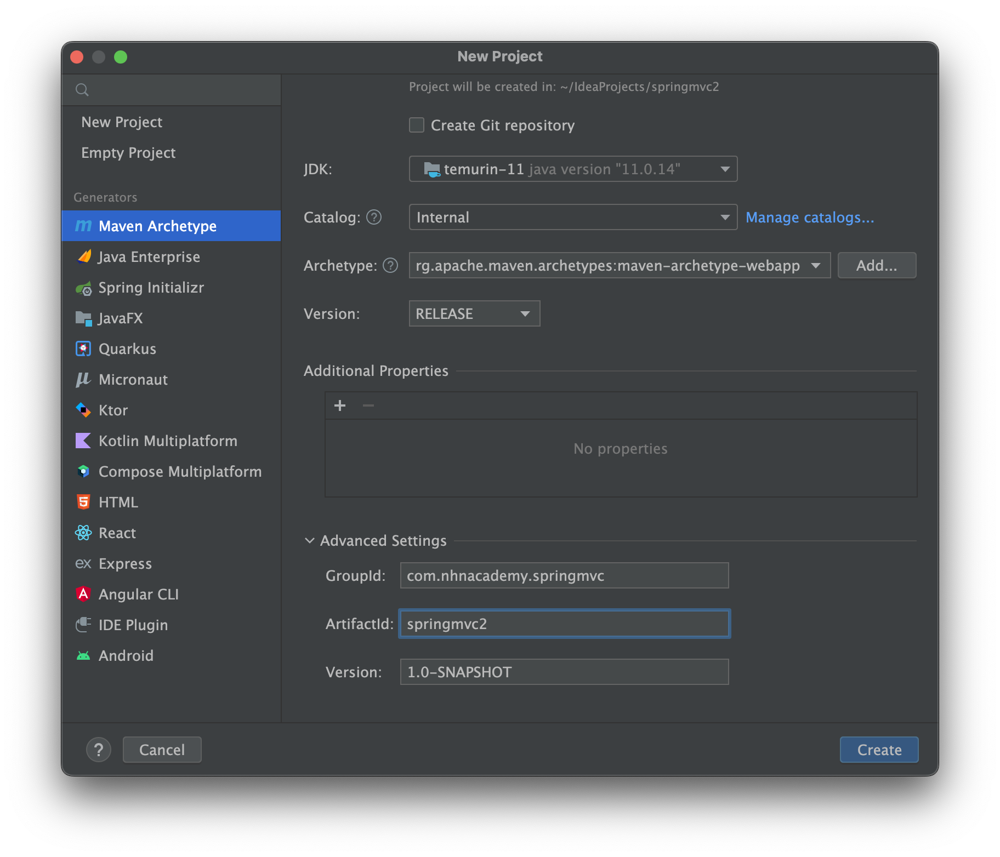

= 실습 - 프로젝트-생성2

== IntelliJ 에서 New Project -> `Maven` 선택

* name: springmvc2
* groupId: com.nhnacademy.springmvc
* artifactId: springmvc2

=== pom.xml

* `dependencyManagement`에 **spring-framework-bom** 추가

[source,xml]
----
<dependencyManagement>
  <dependencies>
    <dependency>
      <groupId>org.springframework</groupId>
      <artifactId>spring-framework-bom</artifactId>
      <version>5.3.25</version>
      <type>pom</type>
      <scope>import</scope>
    </dependency>
  </dependencies>
</dependencyManagement>

----

* 의존 라이브러리에 **spring-mvc** 추가

[source,xml]
----
<dependency>
    <groupId>org.springframework</groupId>
    <artifactId>spring-webmvc</artifactId>
</dependency>

----

* 의존 라이브러리에 **jakarta.servlet-api **추가

[source,xml]
----
<dependency>
    <groupId>jakarta.servlet</groupId>
    <artifactId>jakarta.servlet-api</artifactId>
    <version>4.0.4</version>
    <scope>provided</scope>
</dependency>

----

* packaging war로 설정

----
<packaging>war</packaging>

----

* build plugin `maven-war-plugin` 추가
[source,xml]
----
<plugin>
  <artifactId>maven-war-plugin</artifactId>
  <groupId>org.apache.maven.plugins</groupId>
  <version>3.3.2</version>
</plugin>

----

=== java

==== `com.nhnacademy.springmvc` package 생성

* `Base` 라는 marker interface 생성
** cf.) → Root ApplicationContext Component Scan 위치 잡아주는 역할
* `WebAppInitializer` class 생성 (`web.xml` 대체)

[source,java]
----
public class WebAppInitializer extends AbstractAnnotationConfigDispatcherServletInitializer {
    @Override
    protected String[] getServletMappings() {
        return new String[] { "/" };
    }

    @Override
    protected Class<?>[] getRootConfigClasses() {
        return new Class[] { RootConfig.class };
    }

    @Override
    protected Class<?>[] getServletConfigClasses() {
        return new Class[] { WebConfig.class };
    }

    @Override
    protected Filter[] getServletFilters() {
        CharacterEncodingFilter encodingFilter = new CharacterEncodingFilter();
        encodingFilter.setEncoding("UTF-8");
        encodingFilter.setForceEncoding(true);

        return new Filter[] { encodingFilter, new HiddenHttpMethodFilter() };
    }
}
----

==== `com.nhnacademy.springmvc.controller` package 생성

* `ControllerBase` 라는 marker interface 생성
** cf.) → Servlet ApplicationContext Component Scan 위치 잡아주는 역할

==== `com.nhnacademy.springmvc.config` package 생성

* `RootConfig` class 생성 (Root ApplicationContext용 `@Configuration`)
[source,java]
----
@Configuration
@ComponentScan(basePackageClasses = Base.class,
    excludeFilters = { @ComponentScan.Filter(Controller.class)})
public class RootConfig {
}
----

* `WebConfig.java` 생성 (Servlet ApplicationContext용 `@Configuration`)
** Controller.class는
*** org.springframework.stereotype.Controller

[source,java]
----
@EnableWebMvc
@Configuration
@ComponentScan(basePackageClasses = {ControllerBase.class}, useDefaultFilters = false, includeFilters = @ComponentScan.Filter(Controller.class))
public class WebConfig implements WebMvcConfigurer {
    @Override
    public void configureViewResolvers(ViewResolverRegistry registry) {
        registry.jsp("/WEB-INF/views/", ".jsp");
    }
}
----

==== `com.nhnacademy.springmvc.controller` package 에서

* `NowController` 생성

[source,java]
----
@Controller
public class NowController {
    @GetMapping("/now")
    public String now() {
        return "now";
    }
}
----

=== jsp

==== 디렉토리 추가

* `src/main/webapp` 디렉토리 추가
* `src/main/webapp/WEB-INF` 디렉토리 추가
* `src/main/webapp/WEB-INF/views` 디렉토리 추가

=== jsp 파일 추가

* `now.jsp` 파일 추가

[source,html]
----
<%@ page import="java.util.Date" %>
<%@ page contentType="text/html;charset=UTF-8" language="java" %>
<html>
<head>
    <title>Now</title>
</head>
<body>
    <%= new Date().toString() %>
</body>
</html>
----