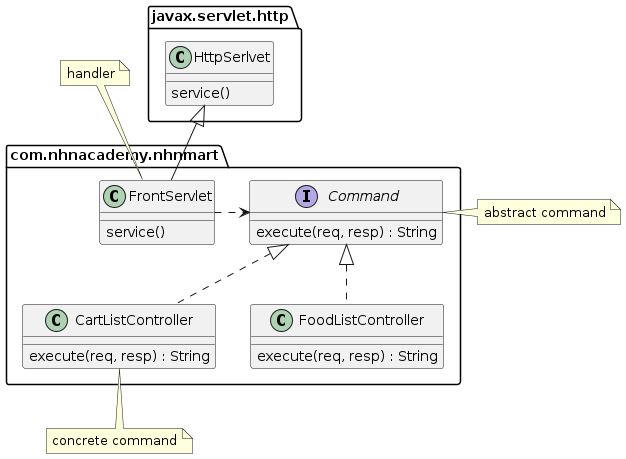

= Spring MVC란?

* Spring Framework이 직접 제공하는 Servlet API 기반의 웹 프레임워크

== Front Controller Pattern

== Spring MVC 에서의 Front Controller

=== DispatcherServlet

* Spring MVC Framework의 중심이 되는 Servlet
* Controller로 향하는 모든 웹 요청의 entry point
* Front Controller 디자인 패턴의 표현

image:resources/img_1.png[Dispatcher-Servlet]
