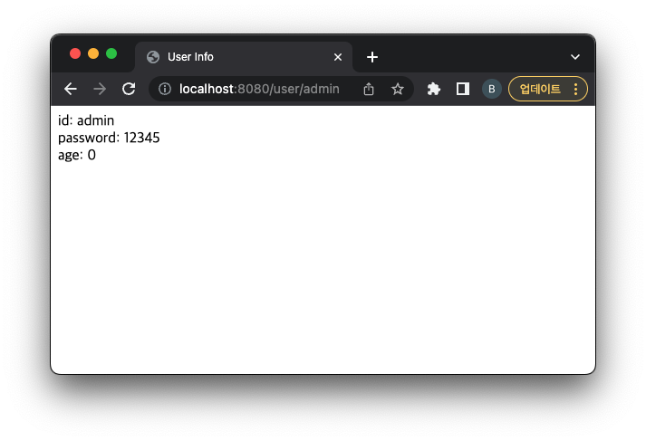
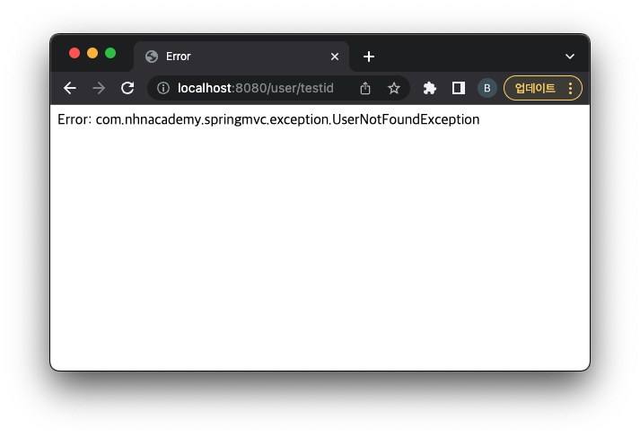

= @ModelAttribute

== @ModelAttribute-1

=== 메서드 인자로 선언된 경우: 모델에서 속성 값을 추출해올 때 사용

[source,java]
----
@PostMapping("/user/register")
public String registerUser(@ModelAttribute UserRegisterRequest userRequest) {
    // ...
}

----

=== @ModelAttribute를 사용하지 않는다면..

----
@PostMapping
public ModelAndView registerUser(String id, String password, String age) {
    // ...
}

----

=== Demo

----
git checkout modelattribute1

----

=== TODO #4: 사용자 등록 처리 - @ModelAttribute - Request Parameter -&gt;. UserRegisterRequest binding

[source,java]
----
@PostMapping
public ModelAndView registerUser(@ModelAttribute UserRegisterRequest userRequest) {
    User user = userRepository.addUser(userRequest.getId(), userRequest.getPassword(), userRequest.getAge());

    ModelAndView mav = new ModelAndView("userInfo");
    mav.addObject("user", User.constructPasswordMaskedUser(user));

    return mav;
}

----

== Request Parameter Binding은 사실 @ModelAttribute를 생략가능

----
public ModelAndView registerUser(UserRegisterRequest userRequest){
    //...
}

----

== @ModelAttribute-2

=== 메서드에 선언된 경우: 모든 `@RequestMapping`에 앞서 호출되어 공통 속성을 제공

[source,java]
----
@ModelAttribute("user")
public User getUser(@PathVariable("userId") String userId) {
    return userRepository.getUser(userId);
}

----

=== Demo

----
git checkout modelattribute2

----

=== UserController getUser method 추가

[source,java]
----
@ModelAttribute("user")
public User getUser(@PathVariable("userId") String userId) {
    return userRepository.getUser(userId);
}

----

=== getUserInfo method를 @ModelAttribute("user")User user 형태로 변경

[source,java]
----
@GetMapping("/{userId}")
public String getUserInfo(@ModelAttribute("user") User user, Model model) {

    if (Objects.isNull(user)) {
        model.addAttribute("exception", new UserNotFoundException());
        return "error";
    }

    model.addAttribute("user", user);
    return "userInfo";
}
----

=== test

* http://localhost:8080/user/admin

* http://localhost:8080/user/testid

=== @ModelAttribute User 객체는 view 까지 전달됨 .. 즉 JSP에서도 User 객체를 사용할 수 있음.

* 결국은 내부적으로 request.setAttribute("user",user)