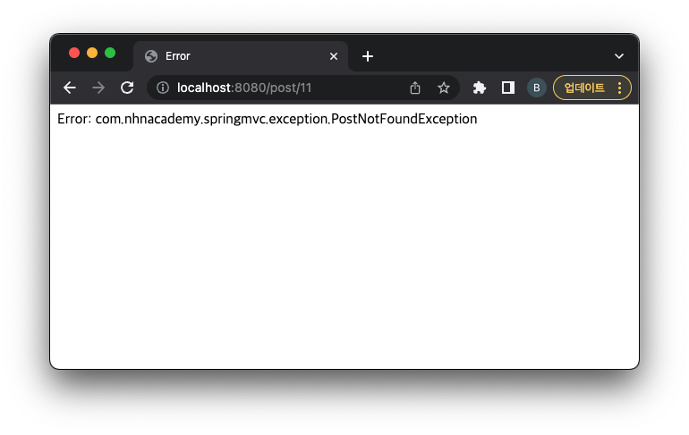

= 실습

== 앞선 *게시물 등록, 조회, 수정 form 만들기* 예제에서

* `PostNotFoundException` 예외 처리를 구현해보자
* isErrorPage="true"
* JSP 내장 객체 exception 이용

[source,html]
----
<%@ page contentType="text/html;charset=UTF-8" isErrorPage="true" language="java" %>
<html>
<head>
    <title>Error</title>
</head>
<body>
  Error: ${exception}
</body>
</html>
----

=== Test
* http://localhost:8080/post/11

