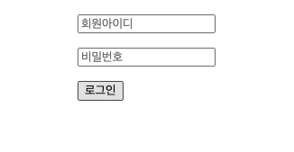
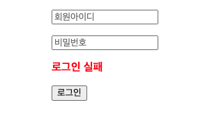
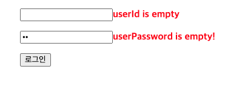
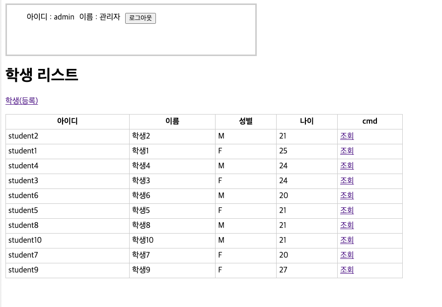
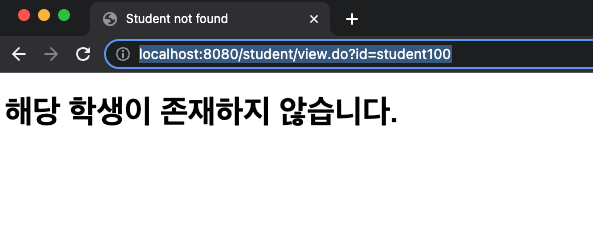
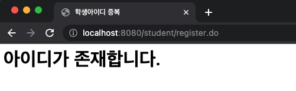
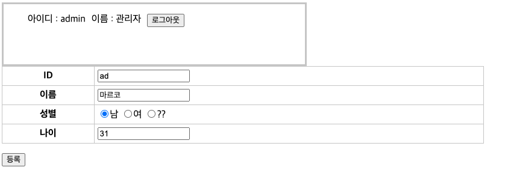
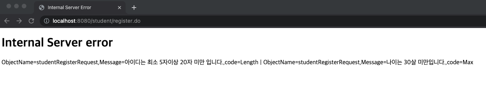

= Servlet/jsp 에서 실습했던 학생 CRUD step4를 기준으로 진행합니다.

== Spring mvc 변경

* spring-mvc 1일차 교제를 참고하여 Spring mvc 기반으로 변경합니다.
* Spring mvc 기반으로 처음부터 만들어도 됩니다.

== login 구현하기

* GET /login
* POST /login

=== 참고

* jsp page를 view resolver에 의해서 호출되면( forwared ) 기본으로 session을 생성합니다.
* session 생성을 방지하기 위해서는 다음과 같이 설정합니다.
** jsp 선언시 session=false로 설정합니다.

[source,jsp]
----
<%@ page contentType="text/html;charset=UTF-8" language="java"  session="false" %>
----

* 로그인 정보는 미리 Bean으로 생성하여 Servlet context 내에서만 공유될 수 있도록 합니다.
* LoginController 내에 user 빈을 주입받아 userId, userPassword 일치여부를 체크 합니다.
** 아이디 : admin , 비밀번호는 : 1234 로 고정합니다.
* 로그인 성공시 session에 key : 'user' , value: user 객체가 등록됩니다.

[source,java]
----
public class User {
    private String userId;
    private String userName;
    private String userPassword;

    public String getUserId() {
        return userId;
    }

    public String getUserName() {
        return userName;
    }

    public String getUserPassword() {
        return userPassword;
    }

    public User(String userId, String userName, String userPassword) {
        this.userId = userId;
        this.userName = userName;
        this.userPassword = userPassword;
    }
}
----

=== 다음은 LoginController 내의 loginForm getMapping하는 method 입니다.

* method 내의 user는 @ModelAttribute를 통해서 session에서 얻은 user 객체 입니다. 이름 참고하여 구현해주세요.

[source,java]
----
@GetMapping(value = {"/",""})
public String loginForm(Model model, User user, HttpServletResponse response){
    if(Objects.nonNull(user)){
        return "redirect:/";
    }
    log.info("message:{}", model.getAttribute("message"));
    model.addAttribute("loginRequest",new LoginRequest());
    return "login/loginForm";
}
----

=== GET /login

* LoginRequest.java

[source,java]
----
public class LoginRequest {
    private String userId;
    private String userPassword;
    public String getUserId() {
        return userId;
    }
    public String getUserPassword() {
        return userPassword;
    }
}
----

* 로그인시 LoginRequest에 setter없이 binding 하려면 ..
** Controller Advice 만들어서 .. 다음과 같이 설정.
*** reflection을 이용해서 직접 field에 binding 하겠다는 의미..
** 직접 setter없이 테스트 해보면.. 왜 해줘야 하는지 차의를 알 수 있음.

----
@InitBinder
void initBinder(WebDataBinder binder){
    binder.initDirectFieldAccess();
}
----

=== 로그인 과정에서 ID, PASSWORD 일치하지 않다면

* 다음과 같이 로그인 실패 출력(RedirectAttributes)를 이용해서 처리해주세요.

=== 로그인 과정에서 비어있는 값이 입력되면

* spring form:form 을 이용해서 구현합니다.
* taglib : spring form 을 추가합니다. ( 직접 공부해보세요) 조금만 공부해 보면 충분히 할 수 있는 정도의 수준..

[source,html]
----
<%@ taglib prefix="form" uri="http://www.springframework.org/tags/form" %>
<%@ taglib prefix="c" uri="http://java.sun.com/jsp/jstl/core" %>
<%--
  Created by IntelliJ IDEA.
  User: visualp
  Date: 2023/04/11
  Time: 7:37 PM
  To change this template use File | Settings | File Templates.
--%>
<%@ page contentType="text/html;charset=UTF-8" language="java" trimDirectiveWhitespaces="true" session="false" %>
<!DOCTYPE html>
<html lang="ko">
<head>
    <title>login</title>
    <link rel="stylesheet" href="/resources/style.css">
</head>
<body>
  

    <form:form method="post" action="/login/" modelAttribute="loginRequest" >
      
<form:input path="userId" type="text" placeholder="회원아이디"  />
        <form:errors path="userId" cssClass="error-message" />
      

      
<form:input path="userPassword" type="password" placeholder="비밀번호" />
        <form:errors path="userPassword" cssClass="error-message" />
      

    <c:if test="${not empty message}">
      
${message}

    </c:if>
        
<button type="submit">로그인</button> 

    </form:form>
  

</body>
</html>
----

=== 로그인이 성공하면 /student/list.do 로 이동하도록 설정합니다.

* 로그인폼을 제외한 모든 페이지에 아래와 같이 아이디,이름 , 로그아웃 버튼이 노출됩니다.
* 아래와 같이 공통된 부분을 jsp:include를 이용해서 구현 합니다.

[source,jsp]
----
  <jsp:include page="/WEB-INF/views/login/loginInfo.jsp" />
----

=== POST /logout

* 로그아웃 버튼을 클릭하면 post 요청으로 처리됩니다.
* 직접 javascript 를 이용해서 button 클릭시 form post로 전송되도록 구현해주세요.
* logout 되면 해야할 일
** Session invalidate 처리 합니다.
** JSESSIONID 쿠키를 삭제 합니다.
** /login 페이지로 redirect 합니다.

=== LoginCheck Filter 만들기

* servlet/jsp loginCheck filter와 동일합니다.
* excludes url은 filterconfig를 이용해서 set 자료구조를 이용해서 등록합니다. ( parameter로 받아서 처리할 필요 없습니다.)
* /WEB-INF/resources/ 하위의 모든 파일은 loginCheck filter에서 제외 합니다.
** /resources/style.css , /resources/script.js 같은 파일들은 정적 resource.. 임으로.. login 체크할 필요 없습니다.

=== StudentRepository 의 구현체인 MapStudentRepository Root Context 내에서 공유할 수 있도록 bean으로 등록합니다.

* MapStudentRepository 생성시 학생 10명을 미리 생성해서 저장합니다.
** 이 부분은 servlet/jsp에서 했던 내용과 동일함.

== Controller Advice

=== 공동의 error 처리를 위해서 404, 500 error를 처리할 수 있도록 @ExceptionHandler을 활용하여 구현 합니다.

=== 404 error를 직접 핸들링 하기위해서는 ..

* handdler 맵핑이 실패하면 404 not found를 throw 하도록 true로 변경합니다.

[source,java]
----
AbstractAnnotationConfigDispatcherServletInitializer 확장한 WebAppInitializer에 createDispatcherServlet 재정의

 @Override
protected FrameworkServlet createDispatcherServlet(WebApplicationContext servletAppContext) {
    DispatcherServlet dispatcherServlet = (DispatcherServlet) super.createDispatcherServlet(servletAppContext);
    dispatcherServlet.setThrowExceptionIfNoHandlerFound(true);
    return dispatcherServlet;
}
----

=== 예외처리-1 학생이 존재하지 않습니다. ( ex id=student100 ) 학생 view 화면 호출시

* http://localhost:8080/student/view.do?id=student100

=== 예외처리-2 중복 아이디 등록

* 등록하는 과정에서 이미 존재하는 student1 입력한다면 다음과 같이 error 발생합니다.

=== 예외처리-3

* validation
** ID : 5~20자
** 이름 : not null, not empty
** 성별 : M or F
** 나이 : 20~30
* 예외 발생을 위해서 ?? &lt;– C로 설정 합니다.

* 아래와 같이 message를 출력합니다. 형식은 자유 입니다.

* enum 을 validation 하기위해서 직접 custom validator를 구현해야함.
* @EnumPattern

[source,java]
----
@Target({METHOD, FIELD, ANNOTATION_TYPE, CONSTRUCTOR, PARAMETER, TYPE_USE})
@Retention(RUNTIME)
@Documented
@Constraint(validatedBy = EnumPatternValidator.class)
public @interface EnumPattern {
    String regexp();
    String message() default " 정규표현 \"{regexp}\"";
    Class<?>[] groups() default {};
    Class<? extends Payload>[] payload() default {};
}
----

* EnumPatternValidator
* ConstraintValidator 를 구현해야함.

[source,java]
----
public class EnumPatternValidator implements ConstraintValidator<EnumPattern, Enum<?>> {
    private Pattern pattern;

    @Override
    public void initialize(EnumPattern annotation) {
        try {
            pattern = Pattern.compile(annotation.regexp());
        } catch (PatternSyntaxException e) {
            throw new IllegalArgumentException("invalid expression", e);
        }
    }

    @Override
    public boolean isValid(Enum<?> value, ConstraintValidatorContext context) {
        if (value == null) {
            return true;
        }
        Matcher m = pattern.matcher(value.name());
        return m.matches();
    }
}
----

* use

[source,java]
----
@EnumPattern(regexp = "M|F")
private Gender gender;
----

=== 예외처리-4

* Spring's Validation