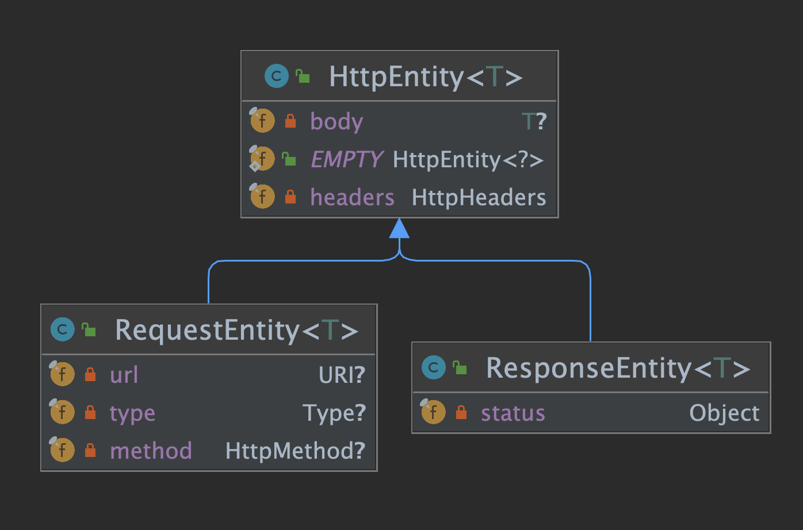

= ResponseEntity

* `@ResponseBody` + http status + response headers

[source,java]
----
@GetMapping("/something")
public ResponseEntity<String> handle() {
    String body = ... ;
    String etag = ... ;
    return ResponseEntity.ok()          // http status (200 OK)
                         .eTag(etag)    // response header (ETAG)
                         .build(body);  // response body
}
----

* Spring Framework에서 제공하는 HttpEntity 클레스는 Http Request/Response에 해당하는 body와 header를 포함하는 클래스

== ResponseEntity ( 응답 )

* headers
* body
* status

== RequestEntity ( 요청 )

* body
* headers
* url
* type
* method