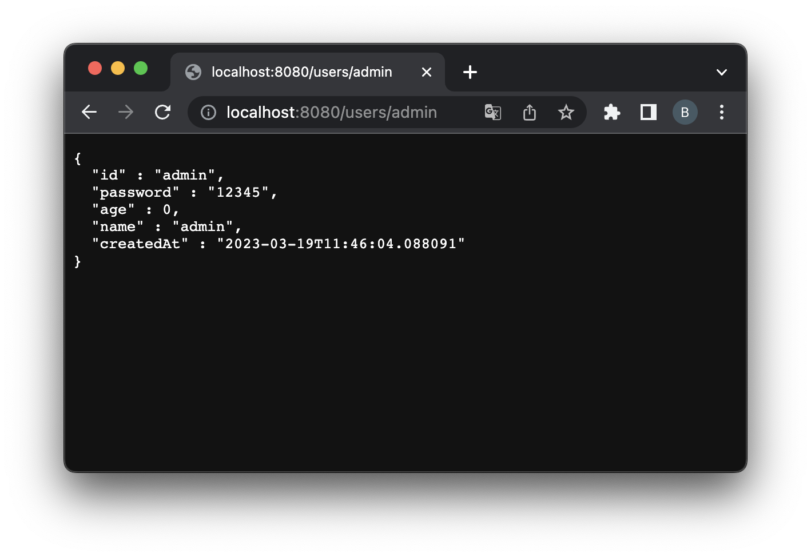

= ResponseEntity 실습

== ResponseEntity

* 앞선 실습 프로젝트에서 `UserRestController.getUser()` 메서드의 리턴 타입을
** `ResponseEntity` 로 바꿔보자
** Http 응답 코드 : 200 리턴하기
** @RestController 사용하기

== UserRestController.java

[source,java]
----
@RestController
public class UserRestController {
    private final UserRepository userRepository;

    public UserRestController(UserRepository userRepository) {
        this.userRepository = userRepository;
    }

    @GetMapping("/users/{userId}")
    public ResponseEntity<User> getUser(@PathVariable("userId")String userId){
        User user = userRepository.getUser(userId);
        ResponseEntity<User> userResponseEntity = new ResponseEntity<>(user, HttpStatus.OK);
        return userResponseEntity;
    }

}
----

== Test

* http://localhost:8080/users/admin

