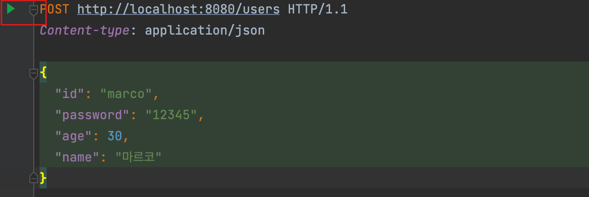

= 실습- RequestBody

== `UserRestController` 에

* 아래 요청을 처리할 수 있는 Controller 메서드를 추가하라

== users.http

* `File&gt; New&gt; HTTP Request` 파일로 생성

----
POST http://localhost:8080/users HTTP/1.1
Content-type: application/json

{
  "id": "marco",
  "password": "12345",
  "age": 30,
  "name": "마르코"
}

----

== 요구사항

* 응답은 HTTP status code 201 (CREATED) 로
* `@RequestBody` 사용

=== UserRestController

[source,java]
----
@PostMapping("/users")
public ResponseEntity<User> registerUser(@Valid @RequestBody UserRegisterRequest userRegisterRequest){
    User user  = userRepository.addUser(userRegisterRequest.getId(),userRegisterRequest.getPassword(),userRegisterRequest.getAge(), userRegisterRequest.getName());
    return new ResponseEntity<>(HttpStatus.CREATED);
}
----

=== user.http

----
POST http://localhost:8080/users HTTP/1.1
Content-type: application/json

{
  "id": "marco",
  "password": "67890",
  "age": 20,
  "name": "마르코"
}
----

=== default 생성자가 없어서 객체를 생성할 수 없는 error 발생 …?

----
HTTP/1.1 500 
Set-Cookie: JSESSIONID=0AF8AC6708A3AF44EB8D1FAF2DB0BD46; Path=/; HttpOnly
Content-Type: text/html;charset=UTF-8
Content-Language: ko-KR
Content-Length: 592
Date: Sun, 19 Mar 2023 03:33:38 GMT
Connection: close

<html>
<head>
    <title>Error</title>
</head>
<body>
Error: org.springframework.http.converter.HttpMessageConversionException: Type definition error: [simple type, class
com.nhnacademy.springmvc.domain.UserRegisterRequest]; nested exception is
com.fasterxml.jackson.databind.exc.InvalidDefinitionException: Cannot construct instance of
`com.nhnacademy.springmvc.domain.UserRegisterRequest` (no Creators, like default constructor, exist): cannot deserialize
from Object value (no delegate- or property-based Creator)
at [Source: (PushbackInputStream); line: 2, column: 3]
</body>
</html>
----

=== delombok : @Value , UserRegisterRequest

[source,java]
----
public final class UserRegisterRequest {

    //생성자
    public UserRegisterRequest (String id, String password, int age, String name){
        this.id = id;
        this.password = password;
        this.age = age;
        this.name = name;
    }

    private final String id;
    private final String password;
    private final int age;

    private final String name;

    public String getId() {
        return this.id;
    }

    public String getPassword() {
        return this.password;
    }

    public int getAge() {
        return this.age;
    }

    public String getName() {
        return this.name;
    }

    public boolean equals(final Object o) {
        if (o == this) return true;
        if (!(o instanceof UserRegisterRequest)) return false;
        final UserRegisterRequest other = (UserRegisterRequest) o;
        final Object this$id = this.getId();
        final Object other$id = other.getId();
        if (this$id == null ? other$id != null : !this$id.equals(other$id)) return false;
        final Object this$password = this.getPassword();
        final Object other$password = other.getPassword();
        if (this$password == null ? other$password != null : !this$password.equals(other$password)) return false;
        if (this.getAge() != other.getAge()) return false;
        final Object this$name = this.getName();
        final Object other$name = other.getName();
        if (this$name == null ? other$name != null : !this$name.equals(other$name)) return false;
        return true;
    }

    public int hashCode() {
        final int PRIME = 59;
        int result = 1;
        final Object $id = this.getId();
        result = result * PRIME + ($id == null ? 43 : $id.hashCode());
        final Object $password = this.getPassword();
        result = result * PRIME + ($password == null ? 43 : $password.hashCode());
        result = result * PRIME + this.getAge();
        final Object $name = this.getName();
        result = result * PRIME + ($name == null ? 43 : $name.hashCode());
        return result;
    }

    public String toString() {
        return "UserRegisterRequest(id=" + this.getId() + ", password=" + this.getPassword() + ", age=" + this.getAge() + ", name=" + this.getName() + ")";
    }
}
----

=== lombok에서 @Value 사용할 때 .. private 기본생성자가 생성되도록 설정하기

* lombok 내부에서 어자피 객체생성은 reflection api를 이용해서 처리함으로 private로 작성되어도 큰 문제 없음

=== lombok.config 작성

* 생성위치 : project root : com.nhnacademy.springmvc
[source,text]
----
lombok.noargsconstructor.extraprivate=true
----

=== maven clean &amp; compile

=== delombok UserRegisterRequest

* /target/classes/com/nhnacademy/domain/UserRegisterRequest.java

[source,java]
----
//
// Source code recreated from a .class file by IntelliJ IDEA
// (powered by FernFlower decompiler)
//

package com.nhnacademy.springmvc.domain;

public final class UserRegisterRequest {
    private final String id;
    private final String password;
    private final int age;
    private final String name;

    public UserRegisterRequest(String id, String password, int age, String name) {
        this.id = id;
        this.password = password;
        this.age = age;
        this.name = name;
    }
    //private 생성자 추가됨
    private UserRegisterRequest() {
        this.id = null;
        this.password = null;
        this.age = 0;
        this.name = null;
    }

    //....
}
----

=== Test

* 201 응답을 확인할 수 있음.

----
http://localhost:8080/users

HTTP/1.1 201 
Content-Length: 0
Date: Sun, 19 Mar 2023 03:47:26 GMT
Keep-Alive: timeout=20
Connection: keep-alive

<Response body is empty>

Response code: 201; Time: 308ms; Content length: 0 bytes

Cookies are preserved between requests:
> /Users/visualp/IdeaProjects/academy-spring-mvc/.idea/httpRequests/http-client.cookies
----