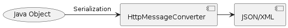

= HttpMessageConverter

----
HttpMessageConverter는 HTTP 요청과 응답의 본문(body)에 있는 데이터를 자바 객체로 변환하거나, 자바 객체를 HTTP 요청 또는 응답의 본문에 있는 데이터로 변환해주는 역할을 하는 인터페이스입니다. 

즉, HttpMessageConverter는 HTTP 통신에서 서버와 클라이언트 간에 전송되는 데이터를 자바 객체로 변환하거나, 자바 객체를 HTTP 요청 또는 응답의 본문에 있는 데이터로 변환하는 역할을 수행합니다.

HTTP 요청과 응답은 일반적으로 텍스트나 바이너리 형태의 데이터로 전송되는데, HttpMessageConverter는 이러한 데이터를 자바 객체로 변환하여 애플리케이션 내에서 처리하기 용이하게 해줍니다. 또한, 자바 객체를 HTTP 요청 또는 응답의 본문에 있는 데이터로 변환하여 원격 서버와 통신할 때 사용됩니다.

예를 들어, 클라이언트에서 JSON 형식으로 데이터를 HTTP 요청의 본문에 담아 서버로 전송하고, 서버는 이를 받아서 자바 객체로 변환하여 처리할 때, HttpMessageConverter가 JSON 데이터를 자바 객체로 변환해주는 역할을 수행합니다. 마찬가지로, 서버에서 클라이언트로 응답할 때도 자바 객체를 HTTP 응답의 본문에 담아 전송하기 위해 HttpMessageConverter를 사용할 수 있습니다.

HttpMessageConverter는 다양한 데이터 형식을 처리할 수 있도록 다양한 구현체들이 제공되며, 주요한 형식으로는 JSON, XML, 텍스트, 바이너리 등이 있습니다. 이를 통해 애플리케이션은 다양한 형식의 데이터를 효율적으로 처리할 수 있게 됩니다.

----

* 자바 객체와 HTTP 요청 / 응답 body를 변환하는 역할

== `HttpMessageConverter` interface

* canRead() , canWrite()
** messageConverter가 해당 class 또는 HTTP 요청의 Conent-Type  mediaType을  지원하는지 체크
* read(), write()
** messageConverter를 통해서 메시지를 읽고 쓰는 기능을 지원
* List getSupportedMediaTypes();
** 현제 지원하는 미디어 타입의 목록을 반환합니다.

[source,java]
----
public interface HttpMessageConverter<T> {

  boolean canRead(Class<?> clazz, @Nullable MediaType mediaType);

  boolean canWrite(Class<?> clazz, @Nullable MediaType mediaType);

  List<MediaType> getSupportedMediaTypes();

  T read(Class<? extends T> clazz, HttpInputMessage inputMessage) /*..*/;

  void write(T t, @Nullable MediaType contentType, HttpOutputMessage outputMessage) /*..*/;
}
----

== @EnableWebMvc

* 자동구성되어 구동되는 Spring mvc 구성을 직접 제어할 때 사용합니다.
* @Congiureation 함께 사용합니다.
* WebMvcConfigurationSupport 에서 구성한 설정을 불러옵니다.
** org.springframework.web.servlet.config.annotation,WebMvcConfigurationSupport;
* 가저온 구성을 재정의하려면 .. WebMvcConfigurer interface를 구현합니다.

----
Defines callback methods to customize the Java-based configuration for Spring MVC enabled via @EnableWebMvc.
@EnableWebMvc-annotated configuration classes may implement this interface to be called back and given a chance to customize the default configuration.
----

* WebConfig implements WebMvcConfigurer

[source,java]
----
@EnableWebMvc
@Configuration
@ComponentScan(basePackageClasses = ControllerBase.class)
public class WebConfig implements WebMvcConfigurer {
    // ... 
}
----

* `WebMvcConfigurationSupport` 에서 default HttpMessageConverter를 제공

[source,java]
----
public class WebMvcConfigurationSupport /*..*/ {
    // ...

  protected final void addDefaultHttpMessageConverters(List<HttpMessageConverter<?>> messageConverters) {
    messageConverters.add(new ByteArrayHttpMessageConverter());
    messageConverters.add(new StringHttpMessageConverter());
    messageConverters.add(new ResourceHttpMessageConverter());
    messageConverters.add(new ResourceRegionHttpMessageConverter());

    // ...
  }
}
----

== HttpMessageConverter 종류

|===
|MessageConvertor 종류 |기능

|ByteArrayHttpMessageConverter |converts byte arrays 
|StringHttpMessageConverter |converts Strings 
|ResourceHttpMessageConverter |converts `org.springframework.core.io.Resource` for any type of octet stream 
|SourceHttpMessageConverter |converts `javax.xml.transform.Source` 
|FormHttpMessageConverter |converts form data to/from a `MultiValueMap&lt;String, String&gt;`. 
|Jaxb2RootElementHttpMessageConverter |converts Java objects to/from XML(added only if JAXB2 is present on the classpath) 
|MappingJackson2HttpMessageConverter |converts JSON(added only if Jackson 2 is present on the classpath) 
|MappingJacksonHttpMessageConverter |converts JSON(added only if Jackson is present on the classpath) 
|AtomFeedHttpMessageConverter |converts Atom feeds(added only if Rome is present on the classpath) 
|RssChannelHttpMessageConverter |converts RSS feeds(added only if Rome is present on the classpath) 
|===
