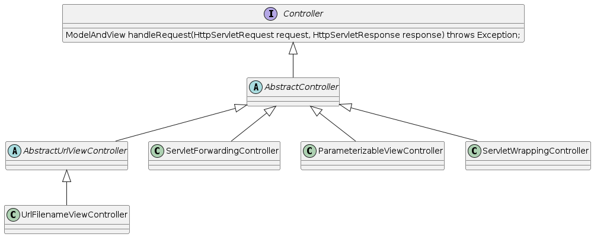
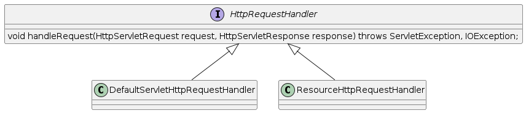

= Handler

== Handler란?

* Controller
* HttpRequestHandler

=== Handler == Controller

* Handler는 그냥 Controller다라고 생각하면 무방함

=== Controller

* jar : org.springframework.spring-webmvc
** package : org.springframework.web.servlet.mvc

[source,java]
----
public class WelcomeController implements Controller {
    @Override
    public ModelAndView handleRequest(HttpServletRequest request, HttpServletResponse response) throws Exception {
        ModelAndView mav = new ModelAndView("index");
        return mav;
    }
}
----

=== HttpRequestHandler

* org.springframework.web.HttpRequestHandler
** *Servlet과 유사함*

[source,java]
----
public class WelcomeHttpRequestHandler implements HttpRequestHandler {
    @Override
    public void handleRequest(HttpServletRequest request, HttpServletResponse response) throws ServletException, IOException {
        RequestDispatcher rd = request.getRequestDispatcher("/WEB-INF/view/index.jsp");
        rd.forward(request,response);
    }
}
----

=== Annotation 기반의 @Controller

[source,java]
----
@Controller
public class HomeController {
    @GetMapping("/")
    public String index() {
        return "index";
    }
}
----

|===
|이름 |설명 

|@Controller |해당 클래스가 Controller임을 나타내기 위한 어노테이션 
|@RequestMapping |요청에 대해 어떤 Controller, 어떤 메소드가 처리할지를 맵핑하기 위한 어노테이션 
|@RequestParam |Controller 메소드의 파라미터와 웹요청 파라미터와 맵핑하기 위한 어노테이션 
|@ModelAttribute |Controller 메소드의 파라미터나 리턴값을 Model 객체와 바인딩하기 위한 어노테이션 
|@SessionAttributes |Model 객체를 세션에 저장하고 사용하기 위한 어노테이션 
|===