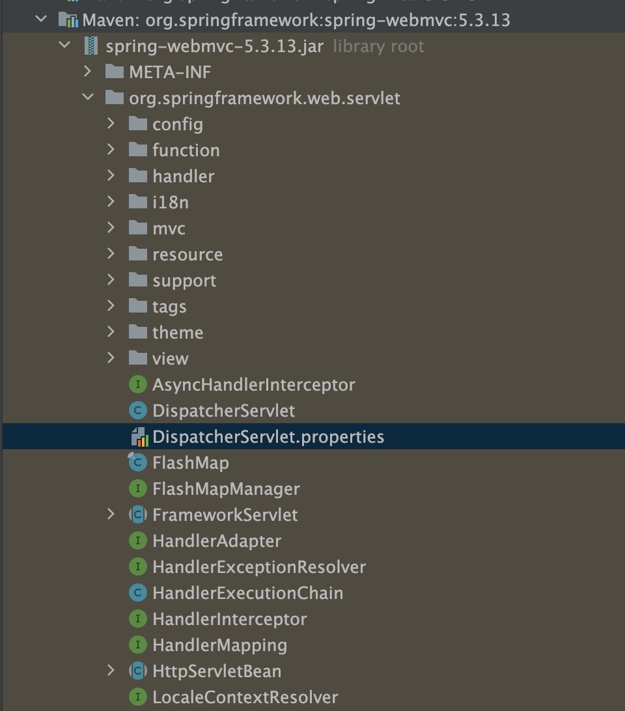

= HandlerAdapter

== DispatcherServlet.properties

[source,properties]
----
org.springframework.web.servlet.HandlerAdapter=org.springframework.web.servlet.mvc.HttpRequestHandlerAdapter,\
	org.springframework.web.servlet.mvc.SimpleControllerHandlerAdapter,\
	org.springframework.web.servlet.mvc.method.annotation.RequestMappingHandlerAdapter,\
	org.springframework.web.servlet.function.support.HandlerFunctionAdapter

----

== HandlerAdapter

=== DispatcherServlet과 실제 핸들러(Controller) 구현 사이를 이어주는 Object Adapter 역할

* `RequestMappingHandlerAdapter`
** `@RequestMapping` + HandlerAdapter
** 우선순위 :0
** 대응 :Annotation 기반의 Controller, **RequestMappingHandlerMapping**
* `HttpRequestHandlerAdapter`
** `HttpRequestHandler` + HandlerAdapter
** 우선순위 :1
** 대응: HttpRequestHandler , Servlet 구현과 비슷함
* `SimpleControllerHandlerAdapter`
** Simple `Controller` + HandlerAdapter
** 우선순위:2
** 대응 : Controller interface를 구현한 클래스, **SimpleUrlHandlerMapping, BeanNameUrlHandlerMapping**

[source,java]
----
@FunctionalInterface
public interface Controller {
	@Nullable
	ModelAndView handleRequest(HttpServletRequest request, HttpServletResponse response) throws Exception;

}
----