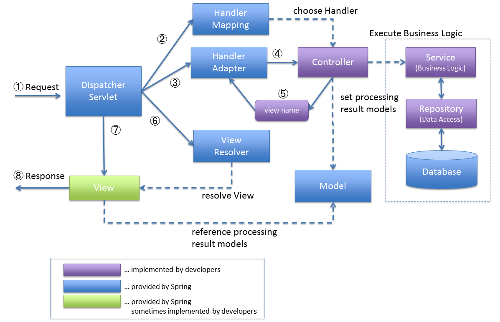

= Spring MVC Components Overview

== Spring MVC Components

* HandlerMapping
* HandlerAdapter
* HandlerExceptionResolver
* RequestToViewNameTranslator
* ViewResolver
* LocaleResolver
* LocaleContextResolver
* ThemeResolver
* MultipartResolver
* FlashMapManager

## Reference
* https://terasolunaorg.github.io/guideline/5.4.1.RELEASE/en/Overview/SpringMVCOverview.html[window=_blank]
