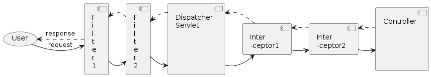
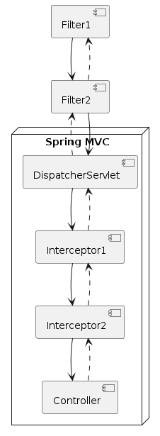

= HandlerInterceptor

== HandlerInterceptor

* Servlet Filter와 유사하게
** DispatcherServlet이 Controller를 호출하기 전/후에
** 요청 및 응답을 참조, 가공할 수 있는 일종의 필터 역할

== `HandlerInterceptor` interface

[source,java]
----
public interface HandlerInterceptor {
  default boolean preHandle(HttpServletRequest req, HttpServletResponse resp, Object handler) /*..*/ {
    return true;
  }

  default void postHandle(HttpServletRequest req, HttpServletResponse resp, Object handler,
                          ModelAndView mav) /*..*/ {

  default void afterCompletion(HttpServletRequest req, HttpServletResponse resp, Object handler,
                          Exception ex) /*..*/ {
  }
}

----

== DispatcherServlet의 HandlerExecutionChain 실행

=== HandlerExecutionChain

* 요청을 처리할 하나의 handler(Controller)와 이 요청에 적용될 여러 interceptor들을 아우르는 요청 처리 객체
[source,java]
----
public class HandlerExecutionChain {
  private final Object handler;
  private final List<HandlerInterceptor> interceptorList = new ArrayList<>();

  // ...
}

----

=== HandlerExecutionChain 실행

[source,java]
----
HandlerExecutionChain mappedHandler = /*..*/;
// ...

if (!mappedHandler.applyPreHandle(processedRequest, response)) {
    return;
}

// Actually invoke the handler.
mv = ha.handle(processedRequest, response, mappedHandler.getHandler());

// ...

mappedHandler.applyPostHandle(processedRequest, response, mv);

----

== Servlet Filter vs HandlerInterceptor

=== 실행 시점이 다르다

* FIlter: `DispatcherServlet` 실행 전/후에 실행
* HandlerInterceptor: `DispatcherServlet` 실행 이후에 Controller 실행 전/후에 실행

=== ApplicationContext 범위가 다르다

* Filter: Root ApplicationContext에 등록/관리
** FIlter는 Servlet ApplicationContext(MVC의 View나 `@ExceptionHandler`)를 이용할 수 없다
* HandlerInterceptor: Servlet ApplicationContext에 등록/관리

== HandlerInterceptor 설정

[source,java]
----
public class WebConfig implements WebMvcConfigurer {
    // ...

    @Override
    public void addInterceptors(InterceptorRegistry registry) {
        registry.addInterceptor(new LocaleChangeInterceptor());
    }
}
----