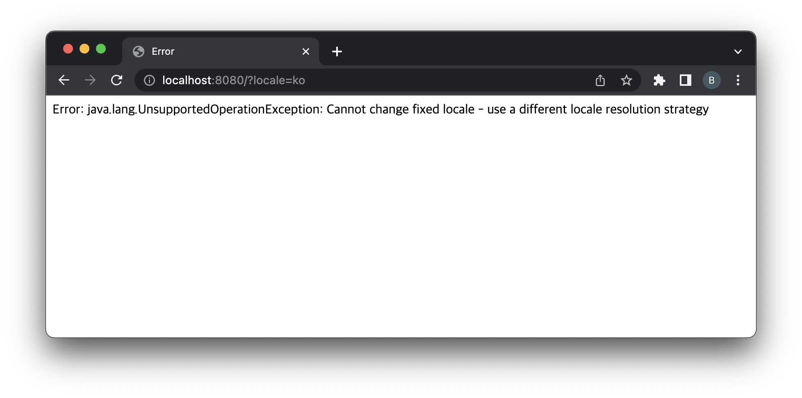
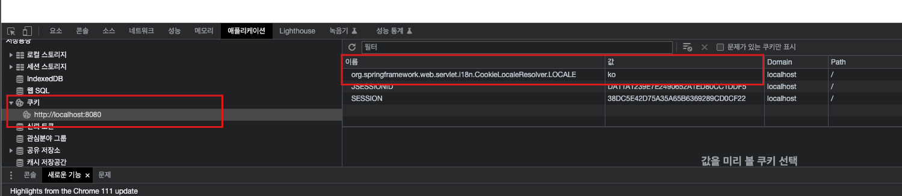
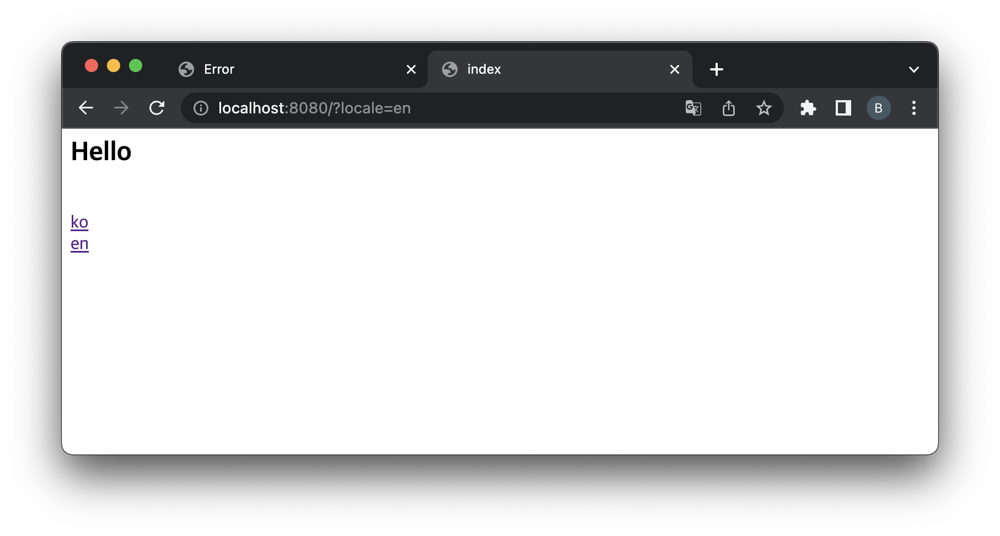

= 실습01-다국어 처리

== HandlerInterceptor를 통한 다국어 처리

* `LocaleResolver`
* `HandlerInterceptor` - `LocaleChangeInterceptor`
* `MessageSource`
* JSTL tag library - formatting tag library (`&lt;fmt:message&gt;`)

----
git checkout interceptor

----

== Test

* FixedLocaleResolver
[source,java]
----
@Bean
public LocaleResolver localeResolver() {
    return new FixedLocaleResolver(Locale.KOREAN);
}
----

* http://localhost:8080/?locale=ko

* *FixedLocaleResolver Bean 제거*
* *CookieLocaleResolver 추가*

[source,java]
----
@Bean
public LocaleResolver localeResolver() {
    return new CookieLocaleResolver();
}
----

* SessionLocaleResolver

