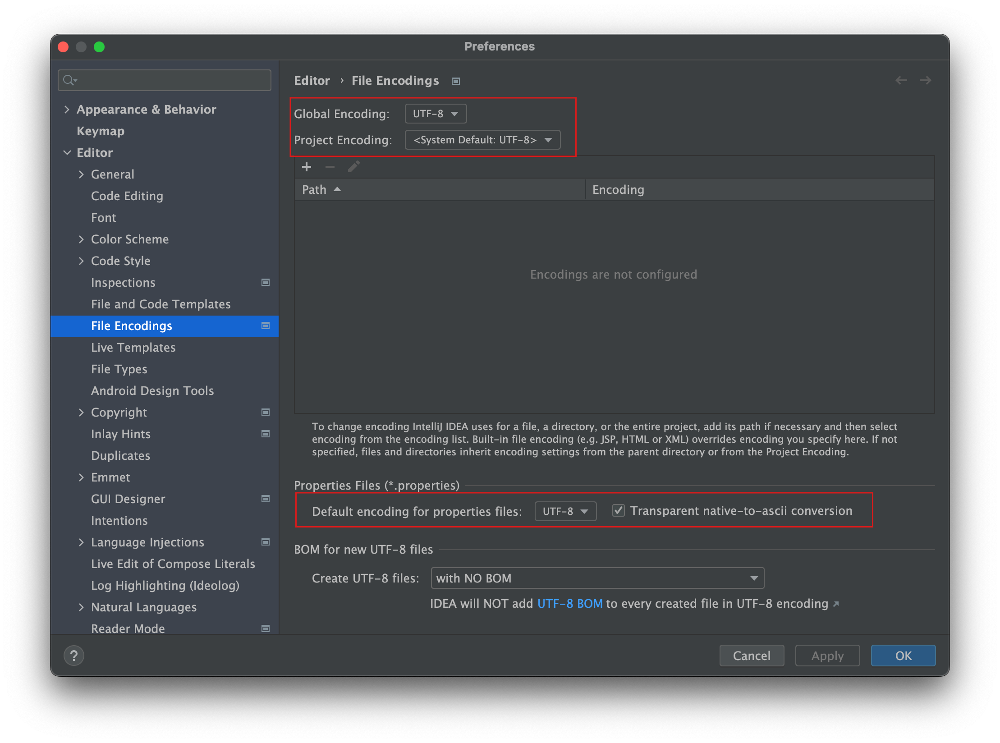

= MessageSource

== `MessageSource` interface

* ApplicationContext's i18n support

[source,java]
----
public interface MessageSource {
  String getMessage(String code, Object[] args, defaultMessage, Locale locale);
  String getMessage(String code, Object[] args, Locale locale) /*..*/;
  String getMessage(MessageSourceResolvable resolvable, Locale locale) /*..*/;
}

----

== `MessageSource` type Bean 등록

* `messageSource`라는 이름의 `MessageSource` 타입의 Bean을 등록해두면
** Spring framework에서 다국어 처리 시 이 Bean을 활용
* RootConfig.java  ( Root Context ) Bean 등록

[source,java]
----
@Bean
public MessageSource messageSource() {
    ResourceBundleMessageSource messageSource = new ResourceBundleMessageSource();
    messageSource.setBasename("message");
//        messageSource.setBasenames("message", "error");

    return messageSource;
}
----

== 한글 깨짐 방지를 위해서

* Preferences &gt; File Encodings
** 모두 UTF-8로 설저
 