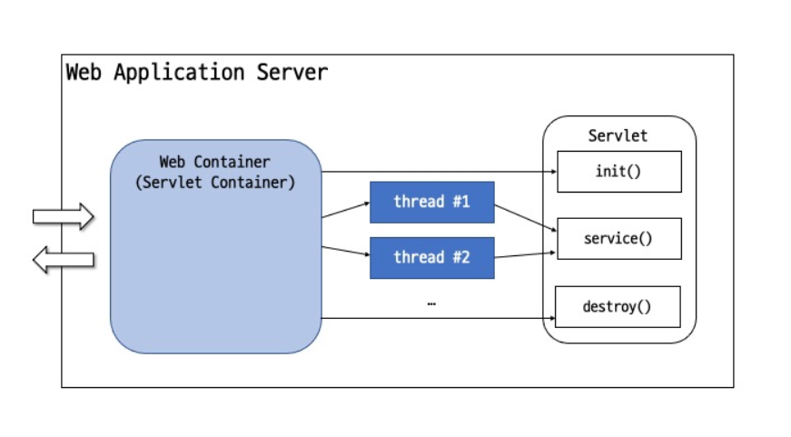

= Connection pool

== Apache commons-dbcp2

* https://commons.apache.org/proper/commons-dbcp/
 Running
** DBCP 2.9.0 binaries should be used by applications running on Java 8 and above.
** DBCP 2.4.0 binaries should be used by applications running under Java 7.
* Javadoc API documents
** https://commons.apache.org/proper/commons-dbcp/apidocs/index.html
* BasicDataSource Configuration Parameters
** https://commons.apache.org/proper/commons-dbcp/configuration.html

|===
|Parameter |Default |Description 

|initialSize |0 |최초 connection pool 시작될 때 초기 Connection 개수 
|maxTotal |8 |최대로 사용할 수 있는 Connection 개수 
|maxIdle |8 |Connection pool에 반납할 때 최대 유지될 수 있는 Connection 수 
|minIdle |0 | 
|maxWaitMillis |indefinitely |풀이 예외를 발생시키기 전에 연결이 반환될 때까지 대기하는 시간(밀리초 단위) 
|validationQuery | |Connection pool에 Connection을 반환하기 전에 해당 풀의 연결여부를 확인 mysql : select 1 oracle : select 1 from dual 
|testOnBorrow |true |pool에서 Connection을 사용하기 위해서(Connction pool에서 Connection 얻어올 때) 유효성 검사 여부 
|testOnReturn |false |Connection을 pool에 반환할 때 유효성 검사 여부 
|===

== db.properties

* src/main/resources/db.properties
[source,properties]
----
db.username={username}
db.password={password}
db.driverClassName=com.mysql.cj.jdbc.Driver
db.url=jdbc:mysql://{address}/{databaseName}
db.initialSize=5
db.maxTotal=5
db.maxIdle=5
db.minIdle=5
db.maxWaitMillis=2000
db.validationQuery=select 1
db.testOnBorrow=true

----

== DatabaseConfig.java

[source,java]
----
@RequiredArgsConstructor
@Configuration
public class DatabaseConfig {
    private final DatabaseProperties databaseProperties;

    @Bean
    public DataSource dataSource(){
        BasicDataSource basicDataSource = new BasicDataSource();
        basicDataSource.setDriverClassName(databaseProperties.getDriverClassName());
        basicDataSource.setUrl(databaseProperties.getUrl());
        basicDataSource.setUsername(databaseProperties.getUsername());
        basicDataSource.setPassword(databaseProperties.getPassword());
        basicDataSource.setInitialSize(databaseProperties.getInitialSize());
        basicDataSource.setMaxTotal(databaseProperties.getMaxTotal());
        basicDataSource.setMinIdle(databaseProperties.getMinIdle());
        basicDataSource.setMaxIdle(databaseProperties.getMaxIdle());
        basicDataSource.setTestOnBorrow(databaseProperties.isTestOnBorrow());
        if(databaseProperties.isTestOnBorrow()) {
            basicDataSource.setValidationQuery(basicDataSource.getValidationQuery());
        }
        return basicDataSource;
    }

    @Bean
    public PlatformTransactionManager transactionManager(){
        return new DataSourceTransactionManager(dataSource());
    }

}

----

== dependency

[source,xml]
----
<!-- dbcp2 -->
<dependency>
    <groupId>org.apache.commons</groupId>
    <artifactId>commons-dbcp2</artifactId>
    <version>2.9.0</version>
</dependency>

<!-- mysql driver -->
<dependency>
    <groupId>com.mysql</groupId>
    <artifactId>mysql-connector-j</artifactId>
    <version>8.0.33</version>
</dependency>
----

== Tomcat Thread Pool

* https://tomcat.apache.org/tomcat-9.0-doc/config/executor.html
** maxThreads : 200
** minSpareThreads : 25
* 1 trhead : 1 connection = 200 thread : 200 connection

